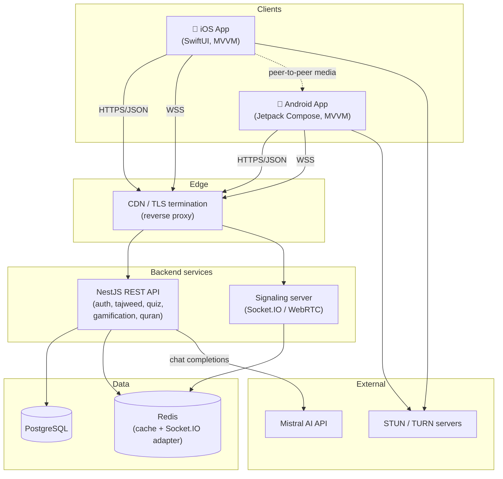
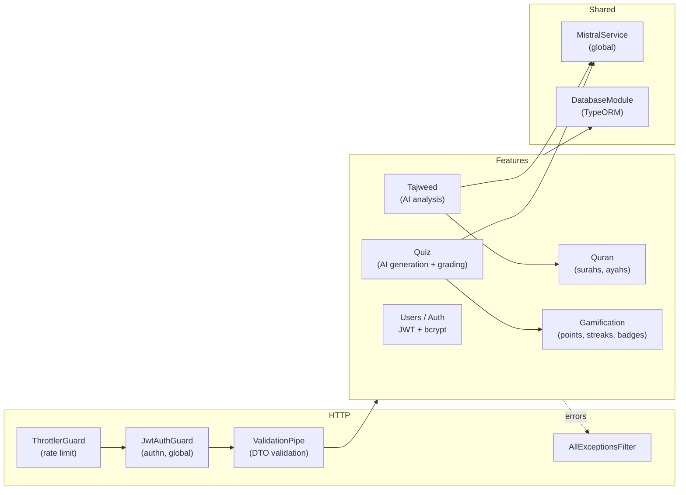
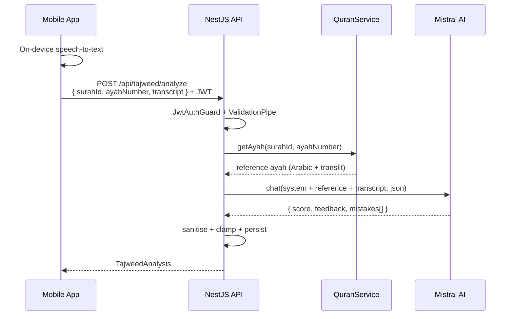
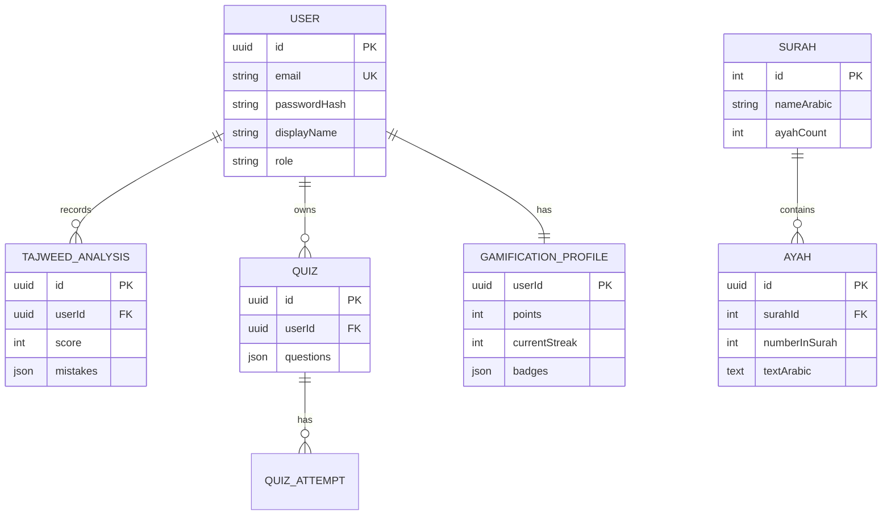
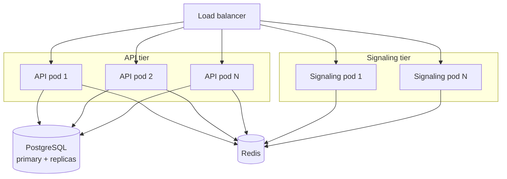

# AI Quran Teacher — Architecture

This document describes the high-level architecture of the AI Quran Teacher
platform: an AI-assisted Quran learning application with real-time tajweed
feedback, AI-generated quizzes, live classes over WebRTC, and gamification.

The diagrams below use [Mermaid](https://mermaid.js.org/), which renders
natively on GitHub.

---

## 1. System context

**Media path:** the signaling server only brokers SDP offers/answers and ICE
candidates. Once negotiated, audio/video flows **peer-to-peer** (or via a TURN
relay when NAT traversal fails) and never transits our servers, which keeps
bandwidth costs and latency low.

---

## 2. Backend module architecture (NestJS)

Key design choices:

- **Secure by default** — a global `JwtAuthGuard` protects every route; a
  handler must opt out with `@Public()` to be reachable anonymously.
- **AI is isolated** behind `MistralService`, so features are unit-testable
  with a mock and the API key lives in exactly one place.
- **Model output is never trusted** — every AI response is validated and
  clamped before it is persisted or returned.
- **Answers stay server-side** — quiz `correctIndex` values are never sent to
  clients; grading happens on the server.

---

## 3. Tajweed analysis sequence

---

## 4. Data model (core entities)

---

## 5. Deployment & scaling

Scaling notes:

- **API tier** is stateless (JWT auth, no server sessions) and scales
  horizontally behind a load balancer.
- **Signaling tier** keeps room membership in memory today. To run more than
  one instance, enable the `@socket.io/redis-adapter` so events fan out across
  pods; the `RoomRegistry` interface is deliberately small to ease that move.
- **Database**: start with a single PostgreSQL primary; add read replicas for
  leaderboard/read-heavy queries. Replace `synchronize` with migrations before
  production.
- **Caching**: cache Quran content and leaderboards in Redis (read-mostly).
- **Cost control**: AI endpoints are rate-limited per user; consider caching
  identical tajweed/quiz requests and pinning a cheaper Mistral model for
  lower tiers.

---

## 6. Security posture

| Concern | Control |
| --- | --- |
| Authentication | Stateless JWT (`@nestjs/jwt`), bcrypt password hashing (cost 12) |
| Authorization | Global `JwtAuthGuard`, ownership checks on quizzes/history |
| Transport | TLS everywhere (HTTPS + WSS), HSTS via Helmet |
| Input validation | Global `ValidationPipe` (whitelist + forbid unknown) |
| Rate limiting | `@nestjs/throttler`, tighter limits on auth and AI routes |
| Secrets | Environment variables, `.env` git-ignored, fail-fast validation |
| CORS | Explicit origin allow-list, no wildcard in production |
| AI safety | Model output validated/clamped; upstream errors never leaked |
| Headers | Helmet (CSP-ready, `X-Powered-By` disabled) |

See [`docs/SECURITY.md`](./SECURITY.md) for the full checklist.
