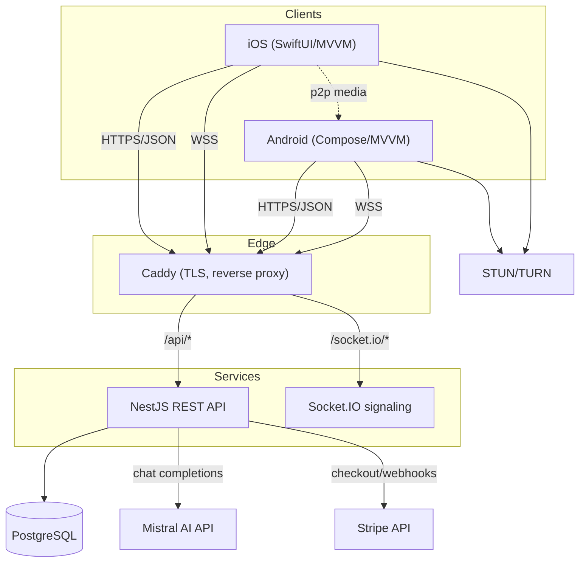
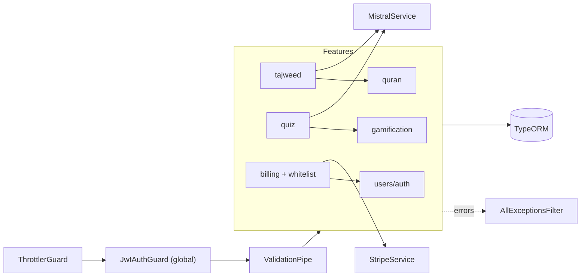
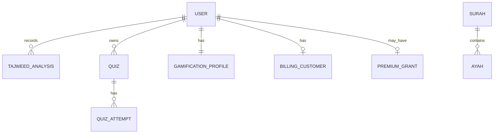

# AI Quran Teacher — Project Blueprint

> Durable engineering knowledge package. Grounded in the repository at
> `AIQuranTeacherProject/` (branch `claude/mistral-ai-quran-teacher-i36jim`).
> Facts are from the code/config; items marked _(inferred)_ are reasoned.

## Executive summary

AI Quran Teacher is an **AI-assisted Quran learning platform**. Learners read
the Quran, get **real-time tajweed (recitation) feedback** powered by Mistral
AI, take **AI-generated quizzes**, earn **gamification** rewards (points,
streaks, badges, leaderboard), join **live classes** over WebRTC, and can
**subscribe** via Stripe (with an admin **premium whitelist** for free comp
access).

The runnable, tested core is two Node services: a **NestJS 11 REST API** and a
**Socket.IO signaling server**. Native **iOS (SwiftUI)** and **Android (Compose)**
clients exist as architectural scaffolds. Everything ships with Docker + a
single-VPS deploy stack (Caddy TLS) and GitHub Actions CI.

## LLM knowledge summary (dense)

- **Stack:** NestJS 11 + TypeScript (strict), TypeORM (SQLite dev / PostgreSQL prod),
  Passport-JWT, Stripe SDK, Mistral via `fetch`; Socket.IO signaling; Docker
  Compose + Caddy; iOS SwiftUI/MVVM + Android Compose/MVVM scaffolds.
- **Backend modules:** `users` (auth), `quran`, `tajweed`, `quiz`,
  `gamification`, `billing` (+ whitelist), plus `common` (Mistral, Stripe,
  guards, filter, decorators), `config`, `database`, `health`.
- **Secure by default:** global `JwtAuthGuard` (HS256 pinned, issuer/audience),
  `RolesGuard` for admin, bcrypt cost 12, global `ValidationPipe`
  (whitelist+forbid), Helmet, CORS allow-list, `@nestjs/throttler`,
  `AllExceptionsFilter`, fail-fast env validation. AI + webhook output never
  trusted blindly.
- **AI isolation:** `MistralService` (mockable) wraps chat-completions; tajweed
  compares a transcript to the reference ayah; quiz generation returns strict
  JSON that is sanitized/clamped. Answers never sent to clients; grading is
  server-side.
- **Billing:** Stripe Checkout subscriptions + Billing Portal (PCI SAQ-A),
  signature-verified webhook over the raw body, idempotent event handling.
  Entitlement = active subscription **OR** non-expired admin whitelist grant.
- **Data:** User, Surah, Ayah, TajweedAnalysis, Quiz, QuizAttempt,
  GamificationProfile, BillingCustomer, PremiumGrant.
- **Tests:** 39 unit + 17 e2e (in-memory SQLite, mocked Mistral/Stripe) + 3
  signaling integration; plus a live `scripts/smoke-test.sh`. CI runs all on PRs.

## Product

- **Purpose:** help Muslims learn to recite the Quran correctly with AI feedback,
  structured practice, and motivation.
- **Target users:** Quran students (primary), teachers (live classes), admins.
- **Core problem:** correct tajweed normally needs a human teacher; this scales
  personalised feedback and practice.
- **Primary features:** Quran reader, AI tajweed analysis, AI quizzes,
  gamification, live classes, subscriptions.
- **Secondary:** premium whitelist (comp access), leaderboards, badges.

## Architecture

- **Media path:** signaling only brokers SDP/ICE; audio/video is peer-to-peer
  (TURN relay on NAT failure) and never transits our servers.
- **Backend is stateless** (JWT auth) → horizontally scalable.
- Full diagrams: `docs/ARCHITECTURE.md`.

## Backend module architecture

## Repository organization

| Path | Purpose |
| --- | --- |
| `backend/src/config` | Typed config + fail-fast env validation |
| `backend/src/database` | TypeORM setup (sqlite/postgres), entity registry |
| `backend/src/common` | Mistral & Stripe services, guards (JWT, Roles), filter, decorators |
| `backend/src/users` | Auth (register/login/me), User entity, JWT strategy |
| `backend/src/quran` | Surah/Ayah entities, seed (Al-Fatihah, Al-Ikhlas), read API |
| `backend/src/tajweed` | AI recitation analysis + history |
| `backend/src/quiz` | AI quiz generation, server-side grading, attempts |
| `backend/src/gamification` | Points, streaks, badges, leaderboard |
| `backend/src/billing` | Stripe subscriptions, portal, webhook, premium whitelist |
| `backend/src/health` | Liveness probe |
| `backend/test` | e2e specs (app, billing) |
| `signaling-server/src` | Socket.IO server, config, RoomRegistry, gateway |
| `ios/`, `android/` | SwiftUI / Compose client scaffolds (MVVM) |
| `deploy/`, `docker-compose.yml` | Caddy, compose stack, provisioning, env example |
| `docs/` | ARCHITECTURE, SECURITY, STRIPE_SECURITY, DEPLOY_LINODE |
| `scripts/smoke-test.sh` | Live end-to-end smoke test |
| `.github/workflows` (repo root) | CI: backend, signaling, iOS, smoke; dependabot |

## Domain model

- **User**: id(uuid), email(unique), passwordHash(select:false), displayName,
  role(student|teacher|admin), timestamps.
- **Surah**: id(1–114 PK), names (ar/translit/translation), revelationPlace,
  ayahCount. **Ayah**: id(uuid), surahId, numberInSurah, textArabic,
  transliteration, translation (unique [surahId, numberInSurah]).
- **TajweedAnalysis**: userId, surahId, ayahNumber, referenceText, transcript,
  score(0–100), mistakes(json), feedback, createdAt.
- **Quiz**: userId, topic, difficulty, questions(json incl. correctIndex — never
  exposed). **QuizAttempt**: quizId, userId, answers, correctCount, totalCount.
- **GamificationProfile**: userId(PK), points, currentStreak, longestStreak,
  lastActivityDate(UTC yyyy-mm-dd), badges(json ids).
- **BillingCustomer**: userId(PK), stripeCustomerId(unique), subscriptionId,
  plan, status, currentPeriodEnd(unix), cancelAtPeriodEnd.
- **PremiumGrant** (whitelist): userId(PK), reason, grantedBy(admin), expiresAt(unix,
  null=indefinite).

## APIs (prefix `/api`)

| Method | Route | Auth | Notes |
| --- | --- | --- | --- |
| GET | `/health` | public | liveness |
| POST | `/auth/register` | public | returns JWT; strong-password rules |
| POST | `/auth/login` | public | constant-time-ish compare |
| GET | `/auth/me` | JWT | current user (no hash) |
| GET | `/quran/surahs`, `/surahs/:id`, `/surahs/:sid/ayahs/:n` | public | content |
| POST | `/tajweed/analyze` | JWT | `{surahId,ayahNumber,transcript}` → AI analysis |
| GET | `/tajweed/history` | JWT | recent analyses |
| POST | `/quiz/generate` | JWT | `{topic?,difficulty,numQuestions}`; answers hidden |
| GET | `/quiz/:id` | JWT | owner-only |
| POST | `/quiz/:id/submit` | JWT | grades, awards points |
| GET | `/gamification/me`, `/badges`, `/leaderboard` | JWT | |
| GET | `/billing/config`, `/billing/me` | JWT | publishable key/plans; entitlement |
| POST | `/billing/checkout`, `/billing/portal` | JWT | Stripe URLs |
| POST | `/billing/webhook` | signature | raw-body verified |
| GET/POST/DELETE | `/billing/whitelist[/:userId]` | admin | comp access mgmt |

Signaling (Socket.IO, JWT handshake): events `join`, `userJoined/Left`,
`offer/answer/iceCandidate`, `chat`, `leave`; HTTP `/health`.

## Business rules (selected)

- IF password < 10 chars OR missing upper/lower/digit → 400 (reject register).
- IF quiz answers length ≠ questions length → 400.
- Quiz points = correct×10 + (perfect ? 20 : 0).
- Streak: same UTC day → unchanged; yesterday → +1; older gap → reset to 1.
- isPremium = (subscription active/trialing AND period not lapsed) OR
  (whitelist grant exists AND (expiresAt null OR expiresAt in future)).
- Webhook: invalid/missing signature → 400; unknown event → 200 ignored;
  handling idempotent.
- Another user's quiz/resource → treated as 404 (no existence probing).

## Deployment

Single Linode VPS via Docker Compose: `db (postgres)` + `backend` + `signaling`
+ `caddy` on an internal network; only Caddy publishes 80/443. Caddy does
automatic HTTPS when `SITE_ADDRESS` is a domain. See `docs/DEPLOY_LINODE.md`.
CI: GitHub Actions (backend, signaling, iOS, smoke) + Dependabot; least-privilege
`permissions: contents: read`.

## Security

JWT HS256 **pinned** (alg-confusion mitigation) + issuer/audience; bcrypt(12);
global auth guard; admin RolesGuard (role read live from DB); Helmet; CORS
allow-list; throttling (tighter on auth/AI); validated/clamped AI output;
Stripe PCI SAQ-A + webhook signatures + idempotency; supply-chain hardening
(Multer override, Dependabot, least-privilege CI). Details: `docs/SECURITY.md`,
`docs/STRIPE_SECURITY.md`.

## Scalability _(inferred)_

Stateless API scales behind a load balancer; signaling needs the Socket.IO
Redis adapter to run multi-instance (RoomRegistry is intentionally small to
swap to Redis); Postgres primary + read replicas for leaderboard reads; cache
Quran/leaderboard in Redis; rate-limit + cache AI calls for cost control.
