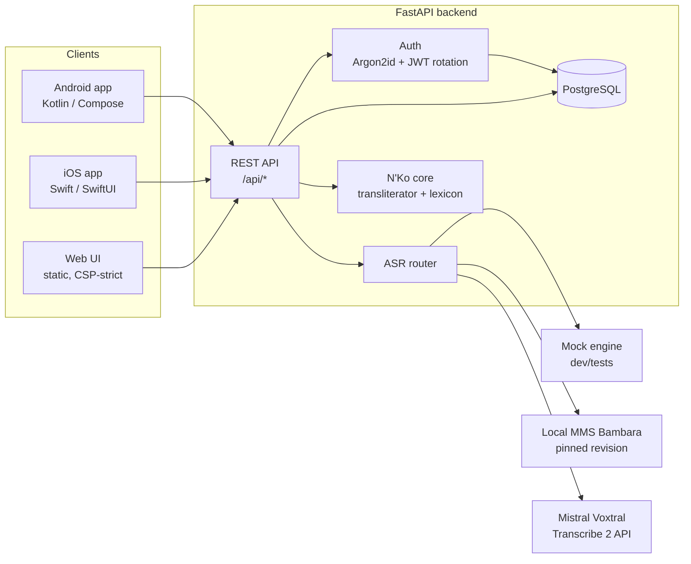

# Architecture

## System overview

## Transcription pipeline

1. Client uploads audio (`POST /api/transcribe`, multipart) with a `language`
   hint (`bam`, `dyu`, `emk`, `fr`, …) and optional `engine` override.
2. Body size is enforced by ASGI middleware **before** multipart parsing;
   the part is then MIME- and magic-byte-validated (WAV/OGG/FLAC/MP3/M4A/WebM).
3. The **ASR router** picks an engine:
   - Manding languages → local engine (`mms`, or `mock` in dev) — Mistral
     Voxtral supports 13 languages and Bambara is not among them.
   - Voxtral-supported languages → `voxtral` when an API key is configured.
   - An explicit `engine` form field overrides routing (validated).
4. Engine returns Latin text; the deterministic transliterator produces N'Ko.
5. Audio bytes are processed in memory and discarded. If the caller is
   authenticated and sent `store_history=true`, the **text** result is saved.

## ASR engine abstraction

`app/asr/base.py` defines the `ASREngine` interface (`name`,
`supports_language()`, `transcribe(audio_bytes, language)`). Implementations:

- `mock.py` — deterministic, zero-dependency; default for dev and CI.
- `mms.py` — `facebook/mms-1b-all` Wav2Vec2 CTC with the Bambara adapter,
  **pinned revision** (`NKO_MMS_REVISION`), optional `local_files_only`.
  Torch/torchaudio/transformers are an optional extra, imported lazily.
- `voxtral.py` — Mistral audio transcription API over httpx with timeouts,
  bounded retries and typed errors; the API key never leaves the server.

Adding an engine = one module + registration in `app/asr/__init__.py`.

## N'Ko core

- `app/nko/tables.py` — character tables for the official Bambara Latin
  orthography (1982) → N'Ko, with documented conventions (coda nasalization →
  U+07F2, syllabic N U+07D2, GBA for g, extended consonants via dot above).
- `app/nko/transliterator.py` — longest-match tokenization, coda-nasal rule,
  graceful passthrough for unmapped input. Pure, deterministic, fully tested.
- `app/nko/block.py` — Unicode block helpers (validation, tone marks for the
  on-screen keyboard).
- `app/retrieval.py` — French↔N'Ko lexicon search (exact > prefix >
  substring ranking) over the bundled dataset.

## Data model

| Table | Purpose |
|---|---|
| `users` | id, email (unique, lowercased), argon2id hash, created_at |
| `refresh_tokens` | SHA-256 token hash, expiry, revocation, rotation chain — enables reuse detection |
| `transcripts` | user_id, language, engine, latin_text, nko_text, created_at — **no audio** |

Migrations are managed with Alembic (`backend/alembic/`). Tests run on
SQLite via SQLAlchemy; production uses PostgreSQL (psycopg3).

## Trade-offs

- **Hybrid ASR** adds an integration seam, but neither option alone covers
  the use case: Voxtral has no Bambara; MMS has no realtime/French quality.
- **Branch-per-component** (as requested) keeps mobile and backend histories
  independent; the cost is cross-component changes needing two PRs. CI path
  filters keep pipelines fast either way.
- **Server-side Mistral key** means mobile apps must talk through the
  backend; that is deliberate — shipping the key in an app binary is not
  recoverable.
