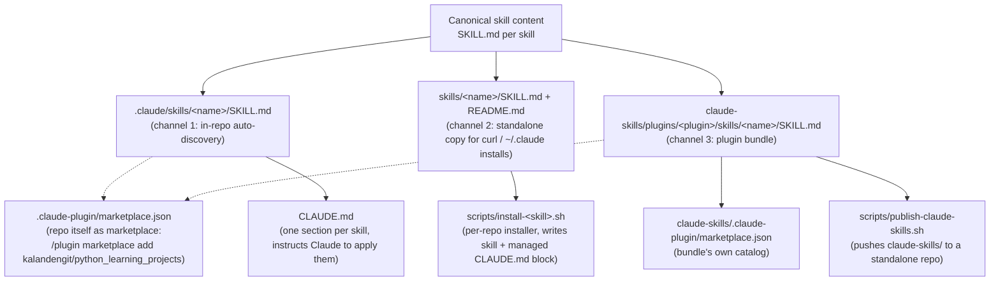

# PROJECT_BLUEPRINT — kalandengit/python_learning_projects

> Generated by `/export_project` on 2026-07-12, from branch
> `claude/project-knowledge-exporter-skills-15hrzl` (7 commits of history).
> **[OBSERVED]** marks facts read directly from the repo; **[INFERRED]** marks
> reasonable conclusions not directly stated anywhere.

## 1. Executive summary

**[OBSERVED]** Despite its name, this repository contains no Python code. It is
a **Claude Code skills distribution repository**: it authors, packages, and
distributes reusable Claude Code *skills* (Markdown behavior definitions) through
three parallel channels — in-repo auto-discovery, a plugin marketplace, and
copy/curl installers. **[INFERRED]** The name `python_learning_projects` is
historical; the Python-oriented `.gitignore` and the placeholder one-line
`README.md` (`# python_learning_projects`) are remnants of the original purpose,
and the repo pivoted to skills distribution at commit `521a035`.

**Product vision [INFERRED from README/CLAUDE.md]:** author a skill once, make
it available in *every* Claude surface — local Claude Code sessions, Claude Code
on the web (where personal `~/.claude` skills don't load), any project via a
plugin marketplace, and claude.ai chats via zip upload.

## 2. Functional overview — the four skills

| Skill (command) | Purpose | Origin |
| --- | --- | --- |
| `it-prompt-specialist` | Senior multidisciplinary IT-expert lens: best practices, secure-by-default, trade-off analysis, depth adapted to user level. Includes a French-language context section. | **[OBSERVED]** adapted from a ChatGPT prompt (`author: OpenAI` in frontmatter) |
| `planning-first` | Enforces plan-before-code: requirement analysis → architecture proposal → numbered plan → files preview → STOP for approval → incremental implementation. French description in frontmatter. | **[OBSERVED]** same origin (`author: OpenAI`) |
| `project-knowledge-exporter` | Two-phase knowledge export: investigate the repo with real tools, then generate a five-file knowledge package (this document is its output). | **[OBSERVED]** authored in-repo (`author: kalandengit`), adapted from a ChatGPT prompt |
| `export_project` | Byte-identical body to project-knowledge-exporter under the short command `/export_project`. | **[OBSERVED]** alias skill; only frontmatter differs |

## 3. Architecture — three distribution channels

**How the channels work [OBSERVED]:**

1. **In-repo** — `.claude/skills/*/SKILL.md` is auto-discovered by Claude Code in
   any session opened on this repo, including the web. `CLAUDE.md` reinforces
   each skill with a prose section (some wrapped in
   `<!-- BEGIN/END <skill> (managed) -->` markers maintained by the installers).
2. **Plugin marketplace** — two catalogs exist: the repo root
   `.claude-plugin/marketplace.json` (marketplace name `kalandengit-skills`,
   plugin sources pointing into `./claude-skills/plugins/...`) makes *this repo*
   installable via `/plugin marketplace add kalandengit/python_learning_projects`;
   `claude-skills/` is a self-contained copy of the same marketplace (own
   `marketplace.json`, README, MIT LICENSE) designed to be published as its own
   repo via `scripts/publish-claude-skills.sh`.
3. **Installers** — `scripts/install-<skill>.sh` write the skill into any target
   repo's `.claude/skills/`, insert/update a managed `CLAUDE.md` block
   idempotently (awk-based in-place block replacement), and optionally
   commit/push on a branch (`COMMIT=1 PUSH=1` env flags). The two older
   installers embed the SKILL.md as a heredoc; the two newer ones fetch it from
   the GitHub raw URL (`RAW_URL` overridable) to keep a single source of truth.

## 4. Repository organization

| Path | Purpose |
| --- | --- |
| `.claude/skills/` | Channel 1: the four auto-discovered skills (canonical copies). |
| `.claude-plugin/marketplace.json` | Makes the repo itself a plugin marketplace. |
| `claude-skills/` | Channel 3: publishable standalone marketplace bundle (catalog + `plugins/<plugin>/{.claude-plugin/plugin.json, skills/<skill>/SKILL.md}` + README + MIT license). |
| `skills/` | Channel 2: standalone per-skill copies with user-facing READMEs (install + usage docs). |
| `scripts/` | Four per-skill installers + the bundle publisher. |
| `CLAUDE.md` | Project instructions: one section per skill telling Claude when/how to apply each. |
| `README.md` | **[OBSERVED]** one-line placeholder — the real docs live in `claude-skills/README.md` and `skills/*/README.md`. |
| `LICENSE` | **[OBSERVED]** GPLv3 at root — see §8 Inconsistencies. |

## 5. Domain model

No database. The "entities" are conventions:

- **Skill** — a `SKILL.md` with YAML frontmatter (`name`, `description`,
  optional `when_to_use`, `version`, `author`) + Markdown body defining
  behavior. Names: lowercase; hyphens by convention, underscore proven to work
  (`export_project`).
- **Plugin** — a directory with `.claude-plugin/plugin.json` (schema
  `claude-code-plugin-manifest.json`) wrapping ≥1 skill. Plugin names are
  hyphenated even when the wrapped skill name has an underscore
  (`export-project` plugin ↔ `export_project` skill).
- **Marketplace** — `marketplace.json` (schema `claude-code-marketplace.json`)
  with `name`, `owner`, and `plugins[]` whose `source` is a relative path.
- **Alias skill** — a skill whose body is byte-identical to another, differing
  only in frontmatter, to expose an additional command name.

## 6. APIs / Deployment / Performance / Observability

**N/A** — no services, endpoints, databases, CI/CD workflows, or Docker in this
repo. "Deployment" is: merge to `main` (raw URLs and marketplace adds reference
`main`), and optionally run `publish-claude-skills.sh <remote-url>` to push the
bundle to a standalone repo (force-pushes `main` from a temp clone; requires a
pre-created empty GitHub repo).

## 7. Business rules (release checklist)

**[OBSERVED from repo structure and git history]** — adding skill *S* means:

- IF a new skill *S* is added, THEN it must appear in **all** of:
  1. `.claude/skills/S/SKILL.md`
  2. `skills/S/SKILL.md` + `skills/S/README.md`
  3. `claude-skills/plugins/<plugin>/skills/S/SKILL.md` + `plugin.json`
  4. both `marketplace.json` files (`plugins[]` entry each)
  5. `scripts/install-<plugin>.sh`
  6. a `CLAUDE.md` section (managed markers if installer-maintained)
  7. the table/install/layout sections of `claude-skills/README.md`
- IF the three SKILL.md copies of a skill differ, THEN it is a bug (verify with
  `diff`); the `.claude/skills/` copy is canonical.
- IF a JSON file changes, THEN validate it parses before committing.
- IF a skill needs a command name Claude Code might reject, THEN verify
  discovery empirically (write the file, confirm the session registers it)
  before propagating to all channels.
- Work happens on feature branches merged via PR (every non-initial commit on
  `main` references a PR number).

## 8. Inconsistencies, risks, and opportunities

1. **License conflict [OBSERVED]** — root `LICENSE` is **GPLv3**, but
   `claude-skills/LICENSE`, all four `plugin.json` files, and every
   `skills/*/README.md` declare **MIT**. Decide one (see DEVELOPMENT_STATE).
2. **Phantom repo references [OBSERVED]** — every `plugin.json` sets
   `"repository": "https://github.com/kalandengit/claude-skills"` and
   `claude-skills/README.md` says `/plugin marketplace add kalandengit/claude-skills`,
   but that standalone repo has not been observed to exist; the publish script
   exists to create its content. Until published, the working install command is
   `/plugin marketplace add kalandengit/python_learning_projects`.
3. **Placeholder root README [OBSERVED]** — one line; doesn't mention the
   marketplace at all.
4. **Content duplication by design [OBSERVED]** — 3 copies per skill (12 SKILL.md
   files for 4 skills) with no sync automation; drift is prevented only by
   discipline/diff. Opportunity: a sync script or CI check.
5. **Python-oriented `.gitignore` [OBSERVED]** — harmless but misleading.
6. **Installer duplication [OBSERVED]** — older installers embed content
   (drift-prone); newer ones curl the raw URL (network-dependent). Opportunity:
   converge on one pattern.

## 9. LLM knowledge summary (dense)

Repo = Claude Code skills marketplace masquerading under a legacy Python-learning
name. Four skills: `it-prompt-specialist` (IT-expert lens), `planning-first`
(plan-before-code gate), `project-knowledge-exporter` (repo-investigating
knowledge exporter), `export_project` (its byte-identical `/export_project`
alias). Each skill ships in 3 copies (`.claude/skills/` canonical,
`skills/` standalone+README, `claude-skills/plugins/` bundle) and is registered
in 2 marketplace catalogs (repo root + bundle). Bundle `claude-skills/` is
publishable as a standalone repo via `scripts/publish-claude-skills.sh`;
per-skill installers write the skill + a managed `CLAUDE.md` block into any
target repo. Conventions: frontmatter `name/description/when_to_use/version/author`;
plugin names hyphenated; underscore skill names work; JSON validated before
commit; PR-based workflow on `claude/*` branches. Known issues: GPLv3 root
LICENSE vs MIT everywhere else; `plugin.json` links to not-yet-published
`kalandengit/claude-skills`; placeholder root README; manual 3-copy sync.
