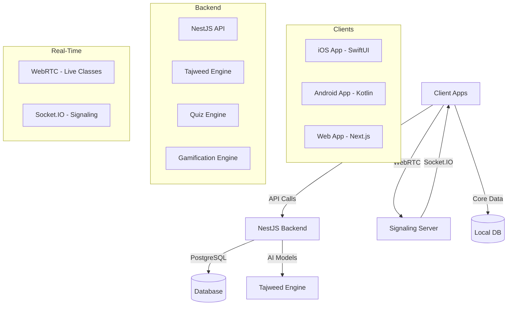

# AI Quran Teacher — Master Implementation Guide

**Version:** 1.0.0
**Last Updated:** July 5, 2026
**Author:** Adaman KEITA
**Description:** A comprehensive guide to building an **AI-powered Quran learning platform** with **iOS/Android apps**, **Tajweed Engine**, **Live Classes**, **Quizzes**, **Gamification**, and **Enterprise Features**.

---

## 📌 Table of Contents
1. [Project Overview](#-project-overview)
2. [System Architecture](#-system-architecture)
3. [What Is Implemented in This Repository](#-what-is-implemented-in-this-repository)
4. [iOS App](#-ios-app)
5. [NestJS Backend](#-nestjs-backend)
6. [WebRTC Signaling Server](#-webrtc-signaling-server)
7. [CI/CD Setup](#-cicd-setup)
8. [Deployment Guide](#-deployment-guide)
9. [Next Steps](#-next-steps)

---

## 🌟 Project Overview

### 🎯 Vision
Build an **enterprise-ready, AI-powered Quran learning platform** that provides:
- **Personalized Quran reading** with real-time AI feedback.
- **Advanced Tajweed correction** and rule enforcement.
- **Hifz (memorization) assistant** with error detection and spaced repetition.
- **Intelligent Islamic tutor** with safe, sourced responses.
- **Multi-role dashboards** (Student, Parent, Teacher, Organization).
- **Multi-language support** (Arabic, English, French, Urdu, Turkish, etc.).
- **Live classes** with video, whiteboard, and chat.
- **Quizzes and gamification** (badges, streaks, leaderboards).
- **Offline mode** for iOS/Android apps.

**Target Users:** Individual students, families, teachers, schools, mosques, Islamic institutes.

---

## 🏗️ System Architecture



| Component | Technology | Purpose |
|---|---|---|
| **iOS App** | SwiftUI, Core Data, AVFoundation | Native app with offline support, Tajweed feedback, live classes |
| **Android App** | Kotlin, Jetpack Compose | Native Android app (roadmap) |
| **Web App** | Next.js, TypeScript | Web-based reader and dashboards (roadmap) |
| **Backend API** | NestJS, TypeORM, PostgreSQL | Users, Tajweed detection, quizzes, gamification |
| **Tajweed Engine** | NestJS (rules) + Python ML (roadmap) | Detects Tajweed mistakes in recitations |
| **Signaling Server** | Node.js, Socket.IO | Real-time connections for live classes |
| **Database** | PostgreSQL | Users, recitation sessions, mistakes, quizzes, gamification |
| **CI/CD** | GitHub Actions | Automated testing, building, deployment |

---

## ✅ What Is Implemented in This Repository

| Feature | iOS | Backend | Verified |
|---|---|---|---|
| Quran Reader | `Views/QuranReader/*` + Core Data + Speech framework | — | Sources complete |
| Tajweed Engine | `Utilities/TajweedEngine.swift` (offline fallback) | `src/tajweed/` (rules + word alignment + persistence) | ✅ unit tested |
| Live Classes | `Utilities/WebRTC/*`, `Views/LiveClass/*` | `signaling-server/` | ✅ smoke tested |
| Quizzes | `Views/Quiz/*`, `QuizViewModel` | `src/quiz/` (bank, generate, grade, XP) | ✅ unit tested |
| Gamification | `Views/Gamification/*` | `src/gamification/` (badges, streaks, leaderboard) | ✅ unit tested |
| Offline Mode | Core Data + bundled `quran.json` | — | Sources complete |
| Users & Roles | — | `src/users/` (student/parent/teacher/org_admin) | Builds |

The backend builds cleanly (`npm run build`) and its 17 unit tests pass
(`npm test`) without a database.

---

## 📱 iOS App

Full structure and setup steps: [`../ios/README.md`](../ios/README.md).

Key design points:
- **Quran Reader** (`QuranReaderView`, `AyahView`): renders vocalized Arabic
  with word-level mistake highlighting, translations, bookmarks, and Tajweed
  rule chips per ayah.
- **Recitation loop**: `SpeechRecognizer` (SFSpeechRecognizer, `ar-SA`,
  on-device when supported) → transcript → `POST /tajweed/detect` → feedback.
  When offline, `TajweedEngine.swift` runs the same rules locally and
  results are stored in Core Data.
- **Live classes**: `WebRTCManager` (stasel/WebRTC) + `SignalingClient`
  (socket.io-client-swift) drive `LiveClassView` with video, a shared
  Canvas whiteboard, and chat.
- **Quizzes & gamification**: thin views over the backend APIs via
  `APIService`.

Required Info.plist keys (already in `Resources/Info.plist`):

```xml
<key>NSMicrophoneUsageDescription</key>
<string>This app needs microphone access to record your Quran recitation for Tajweed feedback.</string>
<key>NSSpeechRecognitionUsageDescription</key>
<string>This app uses speech recognition to analyze your Quran recitation.</string>
<key>NSCameraUsageDescription</key>
<string>This app needs camera access for live Quran classes.</string>
<key>UIBackgroundModes</key>
<array><string>audio</string></array>
```

---

## 🖥️ NestJS Backend

Full module documentation: [`../backend/README.md`](../backend/README.md).

### Setup

```bash
cd backend
cp .env.example .env
createdb ai_quran_teacher
npm install
npm run start:dev
```

### Example: Tajweed detection

```bash
curl -X POST http://localhost:3000/tajweed/detect \
  -H "Content-Type: application/json" \
  -d '{"text": "بسم الله الرحيم", "ayahId": 1, "expectedText": "بِسْمِ اللَّهِ الرَّحْمَٰنِ الرَّحِيمِ"}'
```

Response: word-level `mistakes` (with severity and suggestions), an
`accuracy` ratio, and `rulesToObserve` — the ikhfa/idgham/iqlab/izhar,
qalqalah, ghunnah, and madd occurrences found in the ayah.

---

## 🎥 WebRTC Signaling Server

Event reference and setup: [`../signaling-server/README.md`](../signaling-server/README.md).

```bash
cd signaling-server && npm install && npm start
```

Improvements over the original sketch: per-room participant maps (so
`disconnect` cleanup is O(rooms) and reliable), a `roomParticipants` event so
newcomers know who to send offers to, targeted relay via an optional `to`
socket id, a `leave` event, and a `/health` endpoint.

---

## ⚙️ CI/CD Setup

Workflows in [`.github/workflows/`](../../.github/workflows):

- **`backend-ci.yml`** — Node 20: `npm ci`, build, test; builds the Docker
  image on `main`. Add a registry push (ECR/GHCR) or Heroku deploy step once
  credentials are configured as repository secrets.
- **`signaling-ci.yml`** — installs and smoke-tests the `/health` endpoint.
- **`ios-ci.yml`** — macOS runner; builds and tests with `xcodebuild` once
  the Xcode project is committed (skips gracefully until then). For
  TestFlight, add the `apple-actions/upload-testflight-build` job with these
  secrets: `APP_STORE_CONNECT_API_KEY`, `CERTIFICATE_PASSWORD`,
  `DEVELOPER_TEAM_ID`, `PROVISIONING_PROFILE_BASE64`,
  `DISTRIBUTION_CERTIFICATE_BASE64`.

---

## ☁️ Deployment Guide

### Backend → Heroku

```bash
heroku create ai-quran-teacher-backend
heroku addons:create heroku-postgresql:essential-0
git subtree push --prefix ai-quran-teacher/backend heroku main
```

Set `DB_*` config vars from the `DATABASE_URL` the addon provides, and set
`DB_SYNCHRONIZE=false` once you adopt migrations.

### Backend → AWS ECS (Docker)

```bash
cd ai-quran-teacher/backend
docker build -t ai-quran-teacher-backend .
aws ecr create-repository --repository-name ai-quran-teacher-backend
docker tag ai-quran-teacher-backend:latest <account>.dkr.ecr.<region>.amazonaws.com/ai-quran-teacher-backend:latest
aws ecr get-login-password | docker login --username AWS --password-stdin <account>.dkr.ecr.<region>.amazonaws.com
docker push <account>.dkr.ecr.<region>.amazonaws.com/ai-quran-teacher-backend:latest
```

Then create an ECS cluster + task definition using the image, with an ALB in
front and RDS PostgreSQL.

### iOS → TestFlight / App Store

1. Product → Archive in Xcode (Generic iOS Device).
2. Organizer → Distribute App → App Store Connect → Upload.
3. App Store Connect → TestFlight → add build + testers.
4. Prepare metadata and Submit for Review.

---

## 🚀 Next Steps

### Short-term
1. Create the Xcode project shell and Core Data model ([ios/README.md](../ios/README.md)).
2. Bundle `quran.json` (Tanzil export) for the offline reader.
3. Add authentication (JWT) to the backend and wire real user IDs in the app.
4. Deploy backend + signaling server; point `API_BASE_URL`/`SIGNALING_URL` at them.

### Long-term
1. **ML Tajweed engine** — fine-tune an Arabic ASR/phoneme model on recitation
   audio; swap it in behind `TajweedService.detectMistakes` (the response
   shape is designed to stay stable).
2. **Hifz assistant** — spaced repetition over the persisted
   `tajweed_mistakes` history.
3. **Live class recording**, **AI lesson plans**, **Android (Kotlin)** and
   **Web (Next.js)** clients.
4. **Scale**: migrations instead of schema sync, read replicas, split
   Tajweed/Quiz/Gamification into services when load demands it.

---

## 📌 Resources
- iOS: https://developer.apple.com/documentation/
- NestJS: https://docs.nestjs.com/
- WebRTC: https://webrtc.org/
- PostgreSQL: https://www.postgresql.org/docs/
- Quran text data: https://tanzil.net/download/
- Docker: https://docs.docker.com/ · AWS: https://docs.aws.amazon.com/ · Heroku: https://devcenter.heroku.com/

---

**Happy Coding! 🚀**
*May Allah bless your efforts in spreading Quranic knowledge.*
