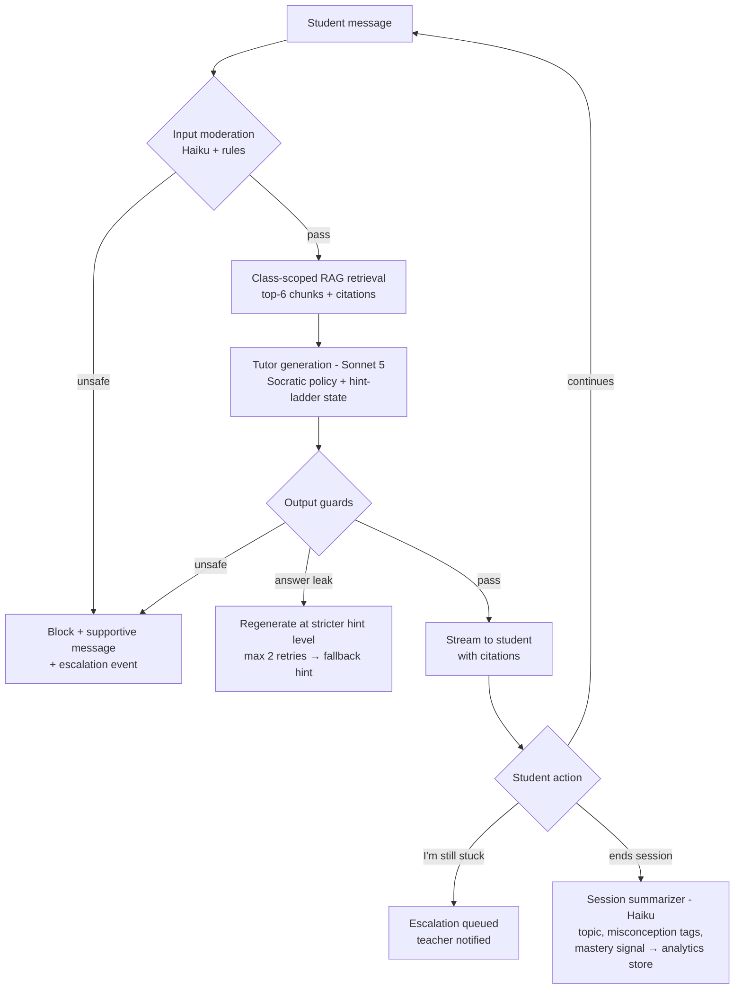
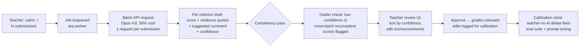
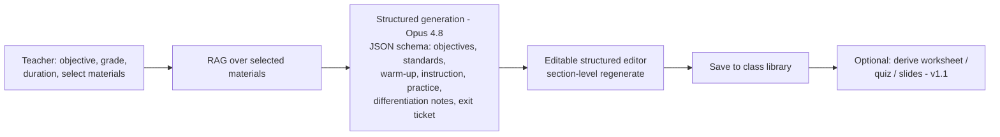
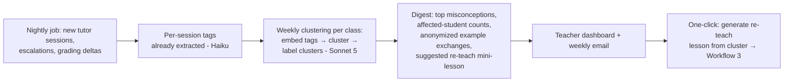
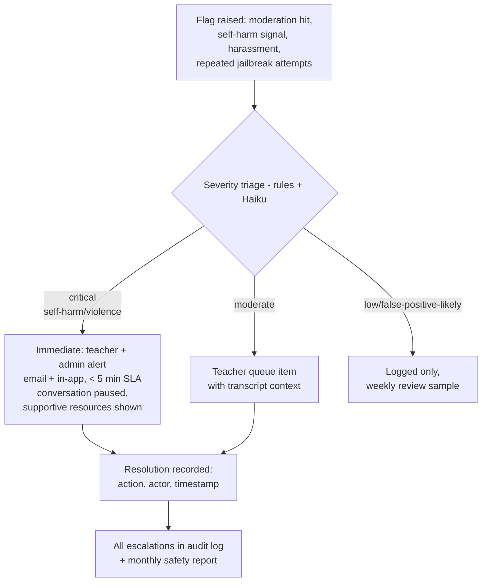

# 05 — Workflow Designs

The five core workflows. Diagrams are Mermaid (render on GitHub).

## 1. Student tutoring loop (Socratic, grounded, guarded)



**Hint-ladder state machine** (per problem, stored in session):
`L1 probe question → L2 concept reminder + citation → L3 analogous worked example →
L4 first-step scaffold → (never) final answer while assignment active`.
Ladder resets per problem; teacher policy can cap the max level.

## 2. Draft grading pipeline (batch, human-in-the-loop)



**Rules:** nothing student-visible before approval; every draft carries evidence quotes from
the submission (no quote → no score, criterion marked "needs human"); confidence < threshold
auto-sorts to top of review queue.

## 3. Lesson planning workflow



Structured outputs (JSON schema enforcement) guarantee the plan always parses into the editor.
Section-level "regenerate just this part" avoids full re-runs (cost + teacher control).

## 4. Insight loop (misconception analytics)



Privacy rule: digests show pseudonymous counts by default; drill-down to named transcripts is
teacher-of-record only and audit-logged.

## 5. Safety escalation workflow



**Design stance:** the system never plays counselor — critical flags route to humans fast,
the student sees age-appropriate supportive language and resources, and the conversation is
paused, not deleted (evidence preservation).

## 6. Cross-cutting: every AI call

```
assemble(prompt_id@ver, cached class prefix, task context)
  → route(task_class → model)            # 06_LLM_SELECTION
  → call with retries/fallback           # circuit breaker
  → trace(model, tokens, cost, latency)  # Langfuse/OTel
  → audit(actor, entity, output hash)    # append-only
```
