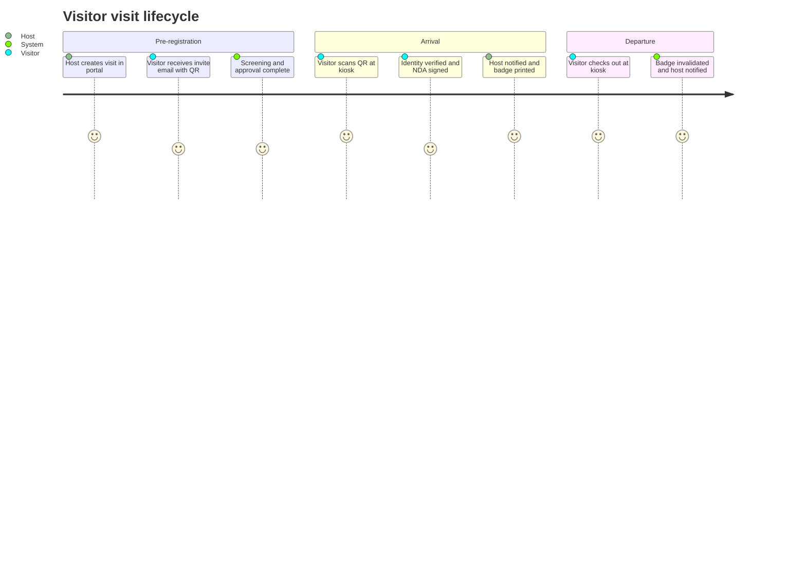

# Section 1 — Product Requirements Document

## 1.1 Executive Summary

The Enterprise Access Management System (AMS) is a cloud-native platform that governs
**who may enter which physical space, when, and under what conditions** across a regulated
enterprise's estate — corporate offices, industrial facilities, manufacturing plants,
laboratories, warehouses, and data centres. It unifies employee/contractor/vendor access,
visitor management, badge lifecycle (QR and RFID), approval workflows, occupancy tracking,
emergency evacuation reporting, and immutable, compliance-grade audit trails.

Today the estate runs 20 sites, 5,000 employees, 15,000 active credentials and ~1,000
visitors/day on a patchwork of site-local systems. By 2030 the platform must serve
**500 sites, 100,000 employees, 250,000 cardholders and 25,000 visitors/day** with
99.95 % availability (99.99 % on the physical-access critical path), sub-200 ms P95 badge
validation, and audit evidence acceptable to ISO 27001, SOC 2 Type II, GDPR and NIST CSF 2.0
assessors.

## 1.2 Problem Statement

- **Fragmentation:** each site operates its own access-control silo; a revoked contractor
  at Site A can still badge into Site B for hours or days.
- **Compliance exposure:** audit evidence is assembled manually per audit cycle; trails are
  mutable, incomplete, and not mapped to control frameworks.
- **Visitor friction:** paper logbooks and ad-hoc email approvals; no pre-registration, no
  watchlist screening, no reliable evacuation muster list.
- **No real-time posture:** security operations cannot answer "who is in Building 4 right
  now?" — a life-safety failure during evacuations.
- **Scale ceiling:** the current systems cannot onboard 480 additional sites without
  per-site capital projects.

## 1.3 Goals & Non-Goals

**Goals**

1. Single logical platform for physical access decisions across all sites, with central
   policy and ≤ 5 s global credential revocation propagation.
2. Immutable, replayable audit trail for every access decision and badge lifecycle event.
3. Self-service visitor pre-registration with host approval, screening, and QR badge issue.
4. Real-time occupancy and one-click evacuation muster reporting per site/zone.
5. Zero Trust security posture (NIST SP 800-207): identity-centric, assume breach,
   phishing-resistant MFA for all operator access.

**Non-Goals**

- Replacing physical controller hardware (turnstiles, readers, door controllers); AMS
  integrates with them through an edge gateway abstraction.
- Logical (IT) access management — Entra ID remains the system of record for workforce
  identity and application entitlements.
- Video surveillance/VMS; AMS emits events a VMS can correlate but does not store video.
- Payroll/time-and-attendance, although check-in events are exportable.
- Building AI/ML anomaly detection or blockchain audit anchoring in the core programme
  (integration seams only — see ADR-019/ADR-020).

## 1.4 Personas (6)

| # | Persona | Role sketch | Top pain points | Primary job-to-be-done |
|---|---------|-------------|-----------------|------------------------|
| P1 | **Maya — Security Operations Lead** | Runs the 24/7 SOC for a region of 60 sites | No live occupancy; alarms arrive by phone; revocations propagate slowly | "See and control the live access posture of every site from one console." |
| P2 | **Tomasz — Site Facility Manager** | Owns one manufacturing plant, 900 staff + contractors | Contractor badges outlive contracts; evacuation musters done on paper | "Know that only currently-authorised people are inside my plant, and account for everyone in an evacuation." |
| P3 | **Aisha — Visiting Contractor** | HVAC engineer visiting 3–4 client sites weekly | 30-minute lobby waits, repeated form-filling, escorts never notified | "Get through reception and to my work area in under five minutes." |
| P4 | **Daniel — Employee Host** | Account manager who hosts customer visits | Books visitors by emailing reception; no-show visibility zero | "Pre-register a visitor in one minute and be pinged when they arrive." |
| P5 | **Ingrid — Compliance & Audit Officer** | Prepares ISO 27001 / SOC 2 evidence | Pulls CSVs from 20 systems; can't prove trails weren't edited | "Produce tamper-evident access evidence for any auditor query in minutes." |
| P6 | **Ravi — Restricted-Area Approver** | Lab director approving clearance-gated access | Approval requests buried in email; no delegation when travelling | "Approve or reject restricted-area requests from my phone, with delegation when I'm away." |

## 1.5 User Journeys

**J1 — Visitor pre-registration → check-in → check-out (P3, P4)**

**J2 — Restricted-area access request (P6):** requester selects area → policy engine
evaluates ABAC preconditions (clearance, training, department) → routed to area owner →
approve/reject/delegate with 2 h escalation → time-boxed grant provisioned to edge →
auto-expiry revocation. (Full state machine in Section 10.)

**J3 — Emergency evacuation (P1, P2):** alarm raised → AMS freezes entries, switches
readers to muster mode → live muster list from occupancy model → wardens sweep zones and
mark persons safe via mobile → completion report archived to WORM audit store.
(Sequence in Section 10.5.)

## 1.6 OKRs (4)

| OKR | Objective | Key Results |
|-----|-----------|-------------|
| O1 | Make physical access centrally governed | KR1: 100 % of sites on AMS by month 18 · KR2: credential revocation propagation ≤ 5 s P99 · KR3: zero shared local admin accounts |
| O2 | Cut visitor friction dramatically | KR1: median kiosk check-in ≤ 90 s · KR2: 80 % of visits pre-registered · KR3: host arrival notification ≤ 10 s P95 |
| O3 | Be continuously audit-ready | KR1: 100 % of access events in immutable store within 60 s · KR2: auditor evidence query turnaround ≤ 15 min · KR3: zero audit findings on access-control evidence |
| O4 | Operate at enterprise reliability | KR1: 99.95 % monthly availability (99.99 % badge-validation path) · KR2: badge validation P95 < 200 ms · KR3: error-budget policy adopted by all service teams |

## 1.7 KPIs (12)

| KPI | Baseline (today) | Target (month 18) | Measurement source |
|-----|------------------|-------------------|--------------------|
| Credential revocation propagation P99 | hours–days | ≤ 5 s | `revocation_propagation_seconds` histogram (Prometheus) |
| Badge validation latency P95 | not measured | < 200 ms | OTel span `ams.access.validate` |
| Visitor kiosk check-in median duration | ~8 min (manual) | ≤ 90 s | kiosk telemetry, `checkin_duration_seconds` |
| Pre-registered visit share | < 10 % | ≥ 80 % | Visitor read model, Grafana business dashboard |
| Host notification latency P95 | n/a | ≤ 10 s | Notification service delivery metric |
| Evacuation muster-list generation | 15–45 min (paper) | ≤ 30 s | Evacuation service SLI |
| Audit event ingestion lag P99 | n/a | ≤ 60 s | outbox→WORM projection lag metric |
| Auditor evidence query turnaround | days | ≤ 15 min | Compliance reporting service query SLI |
| Monthly availability (critical path) | ~99.0 % (est.) | ≥ 99.99 % | synthetic probes + SLO dashboard |
| Approval workflow completion P95 | > 24 h (email) | ≤ 2 h | Approval read model timer metrics |
| Sites onboarded | 0 | 500 by month 30 (100 by month 18) | rollout tracker |
| Orphaned active credentials (owner offboarded) | unknown (est. 3–5 %) | 0 sustained | nightly identity-reconciliation job report |

## 1.8 Functional Requirements (52)

Priorities: **M** = Must, **S** = Should, **C** = Could. Each statement is testable.

### Identity & Cardholder (FR-001–FR-007)

| ID | Pri | Requirement |
|----|-----|-------------|
| FR-001 | M | The system shall synchronise workforce identities (employees, contractors, vendors) from Microsoft Entra ID via SCIM/Graph delta sync at ≤ 15-minute intervals. |
| FR-002 | M | The system shall represent every physical-access holder as a Cardholder with type ∈ {Employee, Contractor, Vendor, Visitor} and a lifecycle state ∈ {PendingOnboarding, Active, Suspended, Offboarded}. |
| FR-003 | M | The system shall automatically suspend all credentials of a cardholder within 60 s of an Entra ID account-disable or offboarding event. |
| FR-004 | M | The system shall enforce a contract validity window on Contractor/Vendor cardholders; all their credentials become invalid at contract end (UTC) without operator action. |
| FR-005 | S | The system shall support bulk cardholder import (CSV, ≤ 50,000 rows) with per-row validation results downloadable as a report. |
| FR-006 | M | The system shall record, for every cardholder, the data-classification-tagged attribute set defined in Section 8.6 and expose it only per RBAC/ABAC policy. |
| FR-007 | S | The system shall run a nightly reconciliation between Entra ID and cardholder records and produce a discrepancy report (orphaned/mismatched records). |

### Visitor Management (FR-008–FR-018)

| ID | Pri | Requirement |
|----|-----|-------------|
| FR-008 | M | A host shall be able to pre-register a visitor (name, email, company, purpose, host, site, time window) in ≤ 5 form fields plus optional extras, in under 60 s. |
| FR-009 | M | The system shall email the visitor an invitation containing a signed, single-use QR code and site arrival instructions upon visit approval. |
| FR-010 | M | The system shall support kiosk self-service check-in via QR scan, including identity confirmation and configurable document signing (NDA, safety briefing). |
| FR-011 | M | The system shall notify the host within 10 s (P95) of visitor check-in via the Notification service (push/email/Teams). |
| FR-012 | M | The system shall support walk-in visitors (no pre-registration) with reception-assisted registration and mandatory host confirmation before badge issue. |
| FR-013 | M | The system shall screen every visitor against configurable internal watchlists at pre-registration and again at check-in; a match blocks badge issue pending security review. |
| FR-014 | M | The system shall check out a visitor via kiosk QR scan, badge drop-box RFID read, or host/reception action, invalidating the visitor badge immediately. |
| FR-015 | M | The system shall auto-check-out visitors at their visit-window end plus a configurable grace period, flagging the visit as "overstay" for review. |
| FR-016 | S | The system shall support recurring visits (e.g., weekly contractor) created as a series with per-occurrence approval inheritance. |
| FR-017 | S | The system shall support group visits (≤ 200 visitors) with bulk invite, bulk check-in mode, and a single host. |
| FR-018 | C | The system shall allow sites to require visitor photo capture at check-in and print it on the badge. |

### Badge Lifecycle (FR-019–FR-027)

| ID | Pri | Requirement |
|----|-----|-------------|
| FR-019 | M | The system shall issue badges of type ∈ {RFID card, QR (digital or printed), temporary RFID} bound to exactly one cardholder. |
| FR-020 | M | The system shall manage badge lifecycle states {Requested, Issued, Active, Suspended, Revoked, Expired, Lost, Returned} as an event-sourced state machine; invalid transitions shall be rejected. |
| FR-021 | M | A badge revocation shall propagate to all online edge validation caches within 5 s (P99) and be enforced at next sync for offline edges. |
| FR-022 | M | The system shall support "report lost/stolen" by the cardholder (self-service) or an operator, which immediately revokes the badge and offers replacement issuance. |
| FR-023 | M | Replacement issuance shall atomically revoke the old badge and issue the new one (no window where both are valid). |
| FR-024 | M | QR badge payloads shall be signed (asymmetric) with issuer key rotation supported; validators shall reject unknown-key or expired signatures. |
| FR-025 | M | Temporary badges shall carry a mandatory expiry ≤ 30 days and auto-expire without operator action. |
| FR-026 | S | The system shall track physical badge stock per site and alert when stock falls below a configurable threshold. |
| FR-027 | S | The system shall support badge design templates per site/legal entity with cardholder photo, name, company and validity date. |

### Physical Access Validation (FR-028–FR-035)

| ID | Pri | Requirement |
|----|-----|-------------|
| FR-028 | M | The system shall validate a badge presentation (QR or RFID) against credential validity, cardholder status, access policy, time schedule, and zone occupancy rules, returning permit/deny in < 200 ms P95. |
| FR-029 | M | Edge gateways shall validate against a locally cached policy/credential snapshot when the cloud is unreachable (offline mode), using last-known-good data with a configurable maximum staleness (default 24 h). |
| FR-030 | M | Every validation decision (permit and deny, online and offline) shall be recorded with reason code, device, site, zone, and timestamp; offline decisions shall be uploaded on reconnect. |
| FR-031 | M | The system shall support anti-passback per zone (a badge inside a zone cannot enter it again without exiting), configurable hard/soft. |
| FR-032 | M | The system shall enforce restricted-area rules: valid time-boxed grant + required clearance + required training certificate, all evaluated via ABAC. |
| FR-033 | S | The system shall support two-person integrity rules for designated zones (entry permitted only when a second authorised badge is presented within 15 s). |
| FR-034 | M | The system shall maintain a per-zone occupancy count derived from entry/exit events, with drift correction at zone-empty events. |
| FR-035 | S | The system shall raise a security alarm event on N consecutive denies (default 3) at one reader within 5 minutes. |

### Approvals, Delegation & Temporary Access (FR-036–FR-042)

| ID | Pri | Requirement |
|----|-----|-------------|
| FR-036 | M | The system shall route access requests to the responsible approver(s) determined by area ownership and policy, supporting single and multi-stage approval chains. |
| FR-037 | M | The system shall escalate an unactioned approval to the fallback approver after a configurable SLA (default 2 h), and again to the area owner's manager after 4 h. |
| FR-038 | M | An approver shall be able to delegate approval authority to a named colleague for a bounded period; delegations are audit-logged and cannot be re-delegated. |
| FR-039 | M | The system shall support temporary access grants with mandatory start/end timestamps; expiry shall revoke edge authorisation without operator action. |
| FR-040 | M | Every approval decision shall record approver identity, decision, timestamp, comment, and the policy version evaluated. |
| FR-041 | S | The system shall let approvers act from email/Teams deep links and the mobile web app with full MFA enforcement. |
| FR-042 | C | The system shall support pre-approved access profiles ("birthright" per role/department) provisioned automatically on onboarding. |

### Occupancy & Emergency (FR-043–FR-047)

| ID | Pri | Requirement |
|----|-----|-------------|
| FR-043 | M | The system shall display real-time occupancy per site/building/zone with ≤ 5 s end-to-end lag (P95). |
| FR-044 | M | On evacuation activation, the system shall generate a muster list of all persons believed on-site within 30 s and stream updates as persons are marked safe. |
| FR-045 | M | Wardens shall mark persons safe/missing from a mobile web view that functions on degraded connectivity (offline queue with sync). |
| FR-046 | M | The system shall produce a post-evacuation report (timeline, muster completeness, exceptions) archived to the WORM audit store. |
| FR-047 | S | The system shall support zone capacity limits with configurable soft (warn) and hard (deny entry) enforcement. |

### Audit, Compliance & Reporting (FR-048–FR-052)

| ID | Pri | Requirement |
|----|-----|-------------|
| FR-048 | M | The system shall write every security-relevant event to an append-only audit store and replicate it to WORM (immutable) blob storage within 60 s (P99). |
| FR-049 | M | The system shall provide auditor evidence queries (who had access to area X during period Y; who approved it; who used it) returning within 15 min for any 12-month window. |
| FR-050 | M | The system shall enforce GDPR retention: visitor PII pseudonymised 90 days after visit end (configurable per legal entity), full erasure workflow on verified data-subject request, with audit-trail integrity preserved via pseudonymous keys. |
| FR-051 | M | The system shall export compliance report packs (access reviews, exception lists, evacuation drills) as signed PDFs/CSVs on schedule and on demand. |
| FR-052 | S | The system shall provide user-access-review campaigns: area owners periodically attest each grant, with automatic revocation of non-attested grants after the campaign deadline. |

## 1.9 Non-Functional Requirements (22)

| ID | Category | Requirement (measurable threshold) |
|----|----------|-------------------------------------|
| NFR-001 | Performance | Badge validation P95 < 200 ms, P99 < 400 ms, measured server-side at the edge gateway API. |
| NFR-002 | Performance | All synchronous API endpoints P95 < 200 ms, P99 < 600 ms at 2× modelled peak load. |
| NFR-003 | Performance | OIDC + MFA interactive authentication P95 < 300 ms, P99 < 500 ms (token acquisition, excluding human MFA interaction time). |
| NFR-004 | Performance | Approval workflow completion (request → final decision incl. escalation) P95 < 2 h, P99 < 4 h. |
| NFR-005 | Availability | Platform availability ≥ 99.95 % monthly; badge-validation critical path ≥ 99.99 % monthly, both excluding announced maintenance ≤ 4 h/quarter. |
| NFR-006 | Availability | Loss of cloud connectivity shall not stop physical access at a site for ≥ 24 h (edge offline mode, NFR tied to FR-029). |
| NFR-007 | Scalability | Sustain 500 sites, 250,000 cardholders, 25,000 visitors/day, and the derived peak load in Section 14.1 with ≤ 70 % steady-state resource utilisation. |
| NFR-008 | Scalability | Horizontal scale-out of any stateless service shall complete within 120 s of an HPA trigger. |
| NFR-009 | Recoverability | RPO ≤ 5 min (OLTP), RPO = 0 for audit/WORM (synchronous append + geo-redundant blob); RTO ≤ 30 min for regional failover of the critical path, ≤ 4 h full platform. |
| NFR-010 | Security | 100 % of service-to-service traffic mTLS (TLS 1.3); zero plaintext internal HTTP, verified by service-mesh policy audit. |
| NFR-011 | Security | All operator/admin access requires phishing-resistant MFA (FIDO2/WebAuthn); password-only auth paths: zero. |
| NFR-012 | Security | Secrets exist only in Azure Key Vault; CI secret-scanning gate (Gitleaks) blocks merges on any detected secret; zero secrets in images, verified by container scan. |
| NFR-013 | Security | Credential revocation propagation to online edges ≤ 5 s P99. |
| NFR-014 | Privacy | All PII encrypted at rest (AES-256) and classified per the Section 8.6 model; logs contain no unmasked PII (automated log-audit check, zero findings). |
| NFR-015 | Privacy | Data-subject erasure requests completed ≤ 30 days; visitor PII pseudonymisation ≤ 90 days after visit end. |
| NFR-016 | Auditability | Audit event ingestion lag ≤ 60 s P99; audit store append-only (no UPDATE/DELETE grants, enforced by role and verified quarterly). |
| NFR-017 | Compliance | Every security control mapped to ISO 27001, SOC 2, GDPR and NIST CSF 2.0 (Section 8.7); mapping reviewed each release. |
| NFR-018 | Observability | 100 % of services emit OTel traces, metrics, and structured logs; trace context propagates across Event Hubs (verified by integration test). |
| NFR-019 | Observability | Every Section-0 latency/availability target has an SLO, error budget, and multi-window burn-rate alert (Section 13.6). |
| NFR-020 | Maintainability | Any single microservice deployable independently ≤ 15 min lead time from merge to production-eligible artefact; architecture tests enforce hexagonal boundaries. |
| NFR-021 | Accessibility | All operator/visitor web UIs conform to WCAG 2.2 AA; axe-core CI gate with zero critical violations. |
| NFR-022 | FinOps | Monthly cloud cost per active cardholder tracked; budget alerts at 80 %/100 % of forecast; autoscaling floor/ceiling reviewed quarterly. |

## 1.10 Acceptance Criteria — top 15 Must FRs (Given/When/Then)

**FR-003 (auto-suspend on offboarding)**
Given a cardholder with two active credentials, When their Entra ID account is disabled,
Then both credentials transition to Suspended within 60 s And a `CardholderSuspended`
audit event exists with reason `IdentityDisabled`.

**FR-008 (fast pre-registration)**
Given an authenticated host, When they submit the minimal visit form with valid data,
Then a visit in state `PendingApproval` (or `Approved` if auto-approval policy matches)
is created And the API round-trip is < 200 ms P95.

**FR-009 (QR invite)**
Given an approved visit, When approval completes, Then the visitor receives an email
containing a signed single-use QR within 60 s And the QR validates at the target site
kiosk only, within the visit window only.

**FR-010 (kiosk check-in)**
Given a visitor with a valid QR arriving within the visit window, When they scan at the
kiosk and complete required documents, Then the visit transitions to `CheckedIn`, a badge
is issued, And total kiosk interaction time is ≤ 90 s median.

**FR-011 (host notification)**
Given a visit transitioning to `CheckedIn`, When the event is published, Then the host
receives a notification within 10 s P95 on every configured channel.

**FR-013 (watchlist screening)**
Given a visitor whose name+DOB matches an active watchlist entry, When check-in is
attempted, Then badge issue is blocked, the visit enters `SecurityReview`, And the SOC
receives an alert within 10 s.

**FR-014 (check-out invalidation)**
Given a checked-in visitor, When they check out via any supported method, Then their
badge validates as `Deny/Revoked` at any reader within 5 s P99.

**FR-020 (badge state machine)**
Given a badge in state `Revoked`, When any actor attempts transition to `Active`,
Then the command is rejected with RFC 7807 error `urn:ams:badge:invalid-transition`
And no event is appended.

**FR-021 (revocation propagation)**
Given 100 online edge gateways subscribed to credential updates, When a badge is revoked,
Then 99 % of gateways enforce the revocation within 5 s and 100 % within 30 s.

**FR-023 (atomic replacement)**
Given a lost badge, When replacement is executed, Then exactly one atomic event pair
(`BadgeRevoked`,`BadgeIssued`) is committed in one stream transaction And at no observable
instant do both badges validate as permitted.

**FR-028 (validation decision)**
Given an active badge with a valid grant for zone Z at time T, When presented at a zone-Z
reader at T, Then the decision is `Permit` in < 200 ms P95 And the decision event carries
policy version, device ID, and reason code.

**FR-029 (offline edge)**
Given an edge gateway disconnected from the cloud for 2 h, When a cached-valid badge is
presented, Then it is permitted locally And the decision uploads within 60 s of reconnect
And badges revoked *after* the last sync are flagged in the reconciliation report.

**FR-037 (escalation)**
Given an approval request unactioned for 2 h, When the SLA timer fires, Then the request
escalates to the fallback approver with notification And after 4 h total to the area
owner's manager, each escalation audit-logged.

**FR-044 (muster list)**
Given an active evacuation for site S, When activation is confirmed, Then a muster list
covering 100 % of persons with an entry event and no exit event for S is available within
30 s And updates stream to warden devices in ≤ 5 s.

**FR-048 (immutable audit)**
Given any security-relevant command handled, When its domain event commits, Then a
corresponding audit record is readable from the append-only store within 60 s P99 And the
WORM blob copy is written with a time-based retention policy that rejects deletion.

## 1.11 Constraints & Assumptions

**Constraints (imposed, non-negotiable)**

- C1: Azure only; West Europe primary, North Europe secondary; EU data residency for all PII (GDPR).
- C2: Microsoft Entra ID is the workforce identity provider; no parallel identity store.
- C3: ISO 27001 / SOC 2 Type II certification must be maintained continuously through rollout.
- C4: Existing door-controller hardware at 20 current sites must be integrated, not replaced (edge-gateway abstraction over OSDP/Wiegand — *protocol details per site survey*).
- C5: Stack fixed to .NET 10 LTS / PostgreSQL 18 / React 19 / MUI v7 per platform standard (Section 15 ADRs).
- C6: Budget approves platform + product teams as staffed in Section 16; no big-bang cutover — phased site migration.

**Assumptions (believed true; validate and revisit if false)**

- A1: Peak visitor arrival concentrates ~20 % of daily volume into the busiest hour (validated against current reception logs; used in Section 14 capacity model).
- A2: Sites have ≥ 2 independent WAN uplinks or LTE failover; offline mode is the exception, not the norm.
- A3: Watchlists are internal (HR/security-maintained); no external government screening integration in scope through month 18.
- A4: Average 4 readers/zone, 25 zones/site at full scale — *illustrative assumption* for capacity modelling, refined per site survey.
- A5: Entra ID tenant supports the required Conditional Access and PIM licensing (Entra ID P2 or equivalent) for all operators.

<!-- SECTION 1 COMPLETE -->
