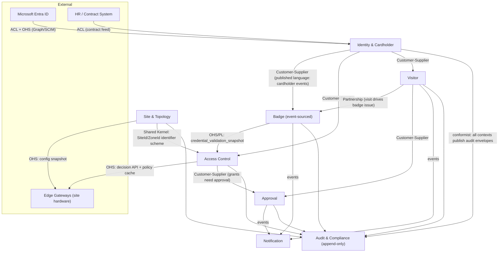

# Section 2 — Domain-Driven Design

Principles satisfied throughout: **DDD** (strategic + tactical), **Hexagonal Architecture**
(repositories as ports), **CQRS/ES applied selectively** per the v6.0 nuance, **EDA**
(integration via domain→integration events).

## 2.1 Bounded Context Overview (8 contexts)

| Context | Core purpose | Persistence verdict | Why |
|---|---|---|---|
| Identity & Cardholder | Mirror workforce identity; own cardholder lifecycle | **CRUD + outbox** | State is a projection of Entra ID + contract data; history needs are met by the audit projection. ES would duplicate Entra's history at high cost. |
| Visitor | Visits, pre-registration, check-in/out, watchlist screening | **CRUD + outbox** | Visit is a short-lived workflow document; GDPR erasure/pseudonymisation is *harder* with immutable ES. Audit projection captures the compliance trail. |
| Badge | Badge lifecycle state machine, credential material | **EVENT-SOURCED** | Regulators ask "prove every state this credential ever had and who caused it." Replayable, immutable history is a first-class functional requirement (FR-020/021/023), not an implementation nicety. |
| Access Control | Policies, grants, validation decisions, occupancy | **CRUD + outbox** for policy/grants; decisions are an **append-only decision log** (insert-only table, not ES aggregates) | Policies need current-state queries and versioning, not replay. Decisions are naturally immutable facts — an append-only log gives ES-grade auditability without aggregate-rehydration cost at 150+ TPS. |
| Approval | Requests, chains, delegation, escalation | **CRUD + outbox** | Workflow state machine with SLA timers; full decision history is captured as audit events. Replay adds nothing operators need. |
| Notification | Multi-channel delivery, templates, preferences | **CRUD + outbox** | Delivery attempts are transient operational data with short retention. |
| Audit & Compliance | Immutable trail, evidence queries, retention | **EVENT-SOURCED / append-only + WORM** | The product *is* the event log. Append-only PG partitions + WORM blob replication; no updates ever. |
| Site & Topology | Sites, buildings, zones, devices, edge config | **CRUD + outbox** | Slowly-changing reference data; versioned config snapshots pushed to edges. |

> Verdict summary: **ES exactly where immutable replayable history is the requirement**
> (Badge, Audit); everywhere else plain CRUD with transactional outbox and an append-only
> audit projection — per the master-prompt nuance and ADR-003.

## 2.2 Context details

### 2.2.1 Identity & Cardholder

- **Aggregates:** `Cardholder` (root) — identity link, type, lifecycle state, contract window, attributes (department, clearance, trainings).
- **Entities:** `ContractAssignment`, `TrainingCertificate`.
- **Value Objects:** `CardholderId` (uuidv7), `PersonName`, `Email`, `CardholderType`, `ClearanceLevel`, `ContractWindow (startUtc,endUtc)`.
- **Domain Services:** `IdentitySyncService` (SCIM/Graph delta → cardholder commands), `ReconciliationService` (FR-007).
- **Repository ports:** `ICardholderRepository { GetAsync(CardholderId); GetByExternalIdAsync(EntraObjectId); AddAsync; UpdateAsync }`.
- **Domain events:** `CardholderOnboarded{cardholderId,type,externalId}`, `CardholderSuspended{cardholderId,reason}`, `CardholderOffboarded{cardholderId}`, `ContractWindowChanged{cardholderId,startUtc,endUtc}`, `ClearanceChanged{cardholderId,old,new}`.

### 2.2.2 Visitor

- **Aggregates:** `Visit` (root) — visitor snapshot, host, site, window, state; `WatchlistEntry` (root, security-owned).
- **Entities:** `VisitDocument` (NDA/safety-brief signature), `GroupVisitMember`.
- **Value Objects:** `VisitId`, `VisitWindow`, `VisitState {Draft, PendingApproval, Approved, CheckedIn, CheckedOut, Cancelled, Expired, SecurityReview}`, `VisitorProfile{name,email,company}` (PII-classified), `ScreeningResult`.
- **Domain Services:** `ScreeningService` (watchlist match at pre-reg + check-in), `OverstayPolicy` (FR-015).
- **Repository ports:** `IVisitRepository`, `IWatchlistRepository`.
- **Domain events:** `VisitRegistered`, `VisitApproved`, `VisitorCheckedIn{visitId,siteId,badgeRef}`, `VisitorCheckedOut{visitId,method}`, `VisitCancelled`, `VisitOverstayed`, `ScreeningHit{visitId,listRef}` — payloads carry IDs + minimal facts, never full PII (GDPR data-minimisation).

### 2.2.3 Badge (event-sourced)

- **Aggregate:** `Badge` (root) — rehydrated from its event stream; enforces the FR-020 state machine.
- **Entities:** none beyond root (credential material is a VO; print jobs live in read models).
- **Value Objects:** `BadgeId`, `BadgeType {Rfid, Qr, TemporaryRfid}`, `BadgeState`, `CredentialMaterial` (RFID facility+card code, or QR key-id + signature params — secret parts referenced via Key Vault, never stored raw), `ValidityWindow`.
- **Domain Services:** `QrSigningService` (port → Key Vault signer, key rotation), `ReplacementService` (atomic revoke+issue, FR-023).
- **Repository port:** `IBadgeRepository { LoadAsync(BadgeId) /* replay */; AppendAsync(events, expectedVersion) /* optimistic concurrency */ }`.
- **Domain events (the stream):** `BadgeRequested`, `BadgeIssued{badgeId,cardholderId,type,validity}`, `BadgeActivated`, `BadgeSuspended{reason}`, `BadgeReinstated`, `BadgeRevoked{reason}`, `BadgeReportedLost`, `BadgeReplaced{oldBadgeId,newBadgeId}`, `BadgeExpired`, `BadgeReturned`.
- **Read models (projections):** `badge_current_state` (per-badge row for queries), `credential_validation_snapshot` (compact structure pushed to edge caches).

### 2.2.4 Access Control

- **Aggregates:** `AccessPolicy` (root, versioned rule set), `AccessGrant` (root, time-boxed cardholder↔zone authorisation), `ZoneOccupancy` (root, per-zone counter with drift correction).
- **Value Objects:** `PolicyVersion`, `Schedule` (time windows, e.g. business hours), `GrantWindow`, `DecisionReason` (enumerated deny/permit codes), `AbacExpression`.
- **Domain Services:** `ValidationService` (FR-028 decision pipeline: credential → cardholder → grant → schedule → ABAC → anti-passback → capacity), `AntiPassbackTracker`, `TwoPersonRule`.
- **Repository ports:** `IAccessPolicyRepository`, `IAccessGrantRepository`, `IDecisionLogWriter` (append-only port).
- **Domain events:** `AccessGranted{grantId,cardholderId,zoneId,window}`, `AccessRevoked{grantId,reason}`, `AccessPolicyPublished{policyId,version}`, `AccessDecisionRecorded{decisionId,badgeId,zoneId,decision,reason,deviceId,offline}`, `ZoneOccupancyChanged{zoneId,count}`, `SecurityAlarmRaised{type,readerId}` (FR-035).

### 2.2.5 Approval

- **Aggregates:** `ApprovalRequest` (root — subject, chain, SLA clock), `Delegation` (root — delegator, delegate, window).
- **Value Objects:** `ApprovalState {Pending, Escalated, Approved, Rejected, Expired, Withdrawn}`, `ApprovalStage`, `SlaPolicy{firstEscalation=2h, secondEscalation=4h}`.
- **Domain Services:** `RoutingService` (area ownership → chain), `EscalationScheduler` (durable timers), `DelegationResolver` (no re-delegation, FR-038).
- **Repository ports:** `IApprovalRequestRepository`, `IDelegationRepository`.
- **Domain events:** `ApprovalRequested`, `ApprovalStageCompleted{stage,decision,actor}`, `ApprovalEscalated{level,to}`, `ApprovalGranted`, `ApprovalRejected{reason}`, `DelegationCreated`, `DelegationRevoked`.

### 2.2.6 Notification

- **Aggregates:** `NotificationRequest` (root — recipient, template, channels, state).
- **Value Objects:** `Channel {Email, Push, Teams, Sms}`, `DeliveryState {Queued, Sent, Delivered, Failed, Suppressed}`, `TemplateKey`.
- **Domain Services:** `ChannelRouter` (preference + fallback ordering), `RateLimiter` (per recipient).
- **Repository port:** `INotificationRepository`.
- **Domain events:** `NotificationQueued`, `NotificationDelivered{channel}`, `NotificationFailed{channel,error,willRetry}`.

### 2.2.7 Audit & Compliance

- **Aggregates:** none in the OLTP sense — the context owns the **append-only audit log** and **evidence read models**; "aggregate" is the audit stream itself.
- **Value Objects:** `AuditEventEnvelope{eventId(uuidv7), occurredUtc, actor, subjectType, subjectId, action, payloadHash, traceId}`, `RetentionClass` (maps to Section 8.6 classification).
- **Domain Services:** `WormReplicator` (PG partition → immutable blob, FR-048), `EvidenceQueryService` (FR-049), `ErasurePseudonymiser` (FR-050 — replaces PII pointers, preserves event integrity via pseudonymous keys).
- **Ports:** `IAuditAppender` (append-only), `IEvidenceStore` (query), `IWormArchive`.
- **Events consumed:** *everything* — the context subscribes to all integration events and appends normalised envelopes.

### 2.2.8 Site & Topology

- **Aggregates:** `Site` (root — buildings, zones tree, timezone, legal entity), `EdgeDevice` (root — gateway/reader/kiosk registration, config snapshot version, health).
- **Value Objects:** `SiteId`, `ZoneId`, `ZonePath` (materialised hierarchy), `DeviceType {Gateway, Reader, Kiosk, Printer}`, `ConfigSnapshotVersion`.
- **Domain Services:** `ConfigSnapshotBuilder` (compiles site policy+credential snapshot for edge sync), `DeviceHealthMonitor`.
- **Repository ports:** `ISiteRepository`, `IEdgeDeviceRepository`.
- **Domain events:** `SiteOnboarded`, `ZoneDefined`, `DeviceRegistered`, `DeviceOffline`, `ConfigSnapshotPublished{siteId,version}`.

## 2.3 Ubiquitous Language Glossary

| Term | Definition |
|---|---|
| Cardholder | Any person eligible to hold credentials: employee, contractor, vendor, or visitor. |
| Credential | A token proving identity to a reader: RFID badge or signed QR. A cardholder may hold several. |
| Badge | The managed lifecycle object wrapping a credential (state machine, validity window). |
| Visit | The planned or actual presence of a visitor at a site within a time window, hosted by an employee. |
| Host | The employee responsible for a visitor during a visit. |
| Zone | The smallest access-controlled spatial unit (room, floor, cage). Zones nest under buildings under sites. |
| Grant | A time-boxed authorisation linking a cardholder to a zone (directly or via profile). |
| Access Profile | A named bundle of grants assignable as a unit (e.g., "Plant-4 Production Staff"). |
| Validation / Decision | The permit/deny outcome of presenting a credential at a reader, with reason code. |
| Anti-passback | Rule preventing a credential from entering a zone twice without an intervening exit. |
| Muster | The evacuation process of accounting for every person believed on-site. |
| Watchlist | Security-maintained list of persons requiring review before site access. |
| Edge Gateway | Site-local service that caches credentials/policies and validates offline. |
| Config Snapshot | Versioned, signed bundle of credentials + policies compiled per site for edge sync. |
| Escalation | Automatic re-routing of an unactioned approval after an SLA timeout. |
| Delegation | Bounded transfer of approval authority from one approver to another; never transitive. |
| WORM | Write-once-read-many immutable storage for audit evidence. |
| Overstay | A visitor still checked in after the visit window plus grace period. |

## 2.4 Context Map

**Relationship notes**

- **ACL (anti-corruption layer)** guards Identity from Entra/HR schema churn — external
  models are translated at the boundary (Hexagonal ports).
- **Shared Kernel** is deliberately tiny: only the `SiteId/ZoneId/CardholderId` identifier
  scheme and event-envelope headers (kept in `Ams.BuildingBlocks`). Anything more couples
  teams.
- **OHS/PL (open-host service / published language):** Badge publishes the
  `credential_validation_snapshot` contract; Site publishes config snapshots. Versioned,
  additive-only evolution (ADR-014).
- **Conformist:** every context conforms to Audit's envelope schema — Audit dictates,
  producers comply, which is correct for a compliance system of record.

## 2.5 Optional-capability seams (deferred by design)

- **AI/ML anomaly detection (ADR-019):** Access Control already publishes
  `AccessDecisionRecorded` to Event Hubs. The seam is a consumer-group contract
  (`anomaly-detection` consumer group) plus an inbound `AnomalySignal{cardholderId, score,
  windowRef}` webhook the SOC dashboard can render. Nothing else is built now.
- **Blockchain-anchored audit (ADR-020):** The seam is `IWormArchive.AnchorAsync(digest)`
  — a daily Merkle-root digest of audit partitions that an anchoring adapter *could* post
  externally. The digest is computed and stored today (cheap, useful for tamper-evidence);
  the external anchoring adapter is deferred.

<!-- SECTION 2 COMPLETE -->
