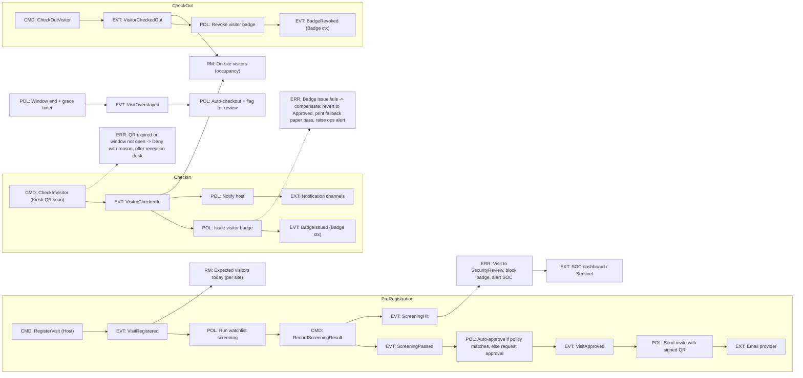
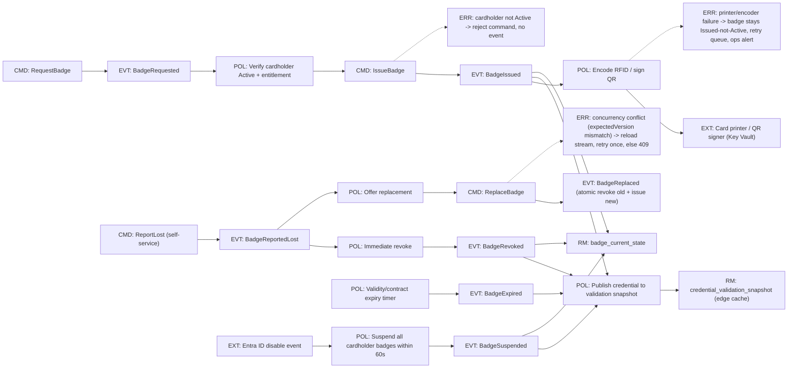
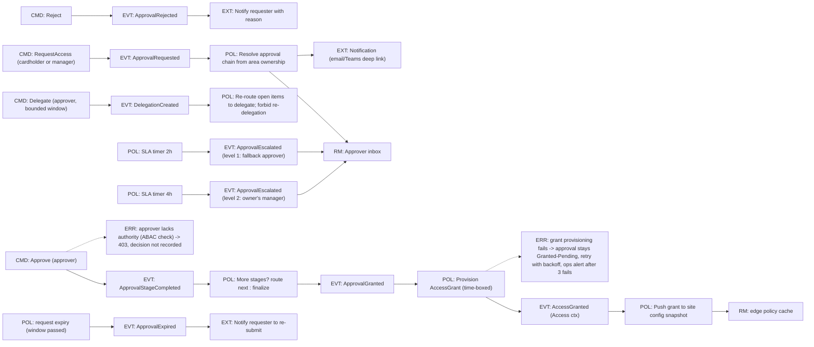
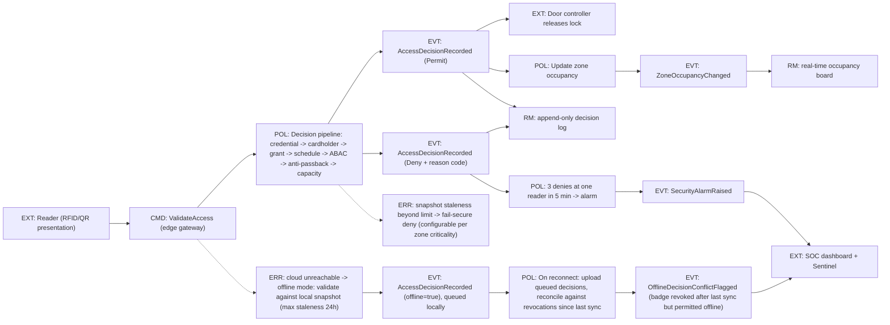

# Section 3 — Event Storming

Notation used in the diagrams: `CMD:` command · `EVT:` domain event · `POL:` policy /
reaction · `RM:` read model · `EXT:` external system · `ERR:` failure / compensation path.
Principles: **EDA** (events as the integration fabric), **DDD** (commands target
aggregates), **CQRS** (read models are explicit).

## 3.1 Visitor Management flow

**Failure/compensation paths:** screening hit → `SecurityReview` (no badge until security
clears); badge-issue failure → saga compensation back to `Approved` with manual fallback;
overstay timer → auto-checkout + review flag; kiosk offline → reception-assisted flow
(Section 10.1).

## 3.2 Badge Lifecycle flow

**Failure/compensation:** encoder failure leaves the badge `Issued` (not `Active`) with a
retry queue; optimistic-concurrency conflicts on the event stream retry once then surface
RFC 7807 409; revocation events always win over issuance in snapshot merge (tombstone
precedence, Section 14.3).

## 3.3 Access Approval flow

## 3.4 Physical Access Validation flow

**Failure/compensation:** offline validation is a designed degradation, not an error —
decisions queue and reconcile on reconnect, with conflicts (revoked-but-permitted) flagged
to the SOC; snapshot beyond max staleness fails secure on restricted zones and fail-open
is an explicit per-zone life-safety configuration (never default).

<!-- SECTION 3 COMPLETE -->
