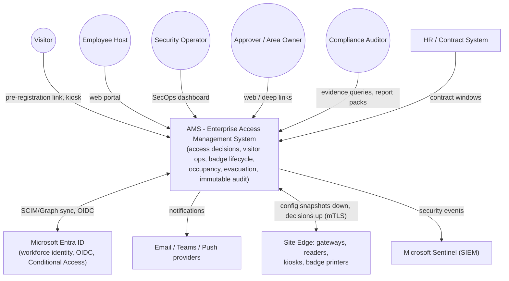
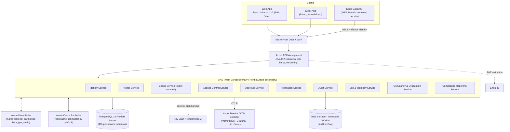
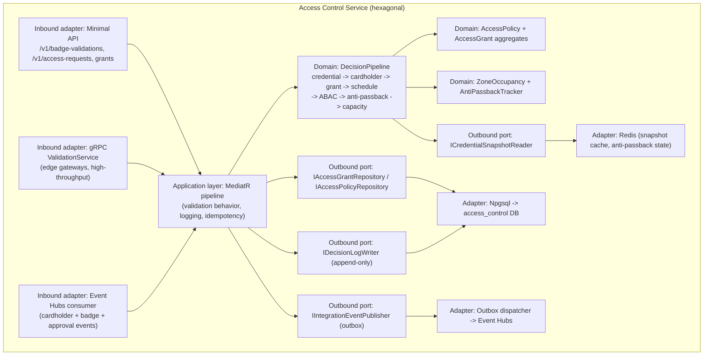
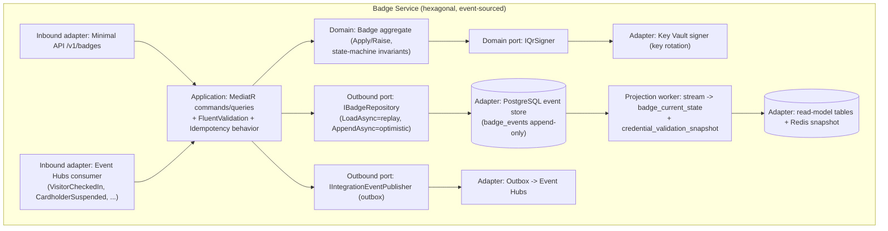

# Section 4 — C4 Architecture

Principles: **Cloud Native** (containers on AKS, selective serverless), **Zero Trust**
(every hop authenticated), **Hexagonal** (L4 shows ports & adapters), **12-Factor**
(stateless services, env config).

## 4.1 L1 — System Context



## 4.2 L2 — Container Diagram



DB-per-service is strict (Section 6 matrix): one Flexible Server per region hosts
isolated databases/roles per service; no cross-service SQL, ever (enforced by network
policy + credentials).

## 4.3 L3 — Component: Access Control Service



## 4.4 L3 — Component: Badge Service



## 4.5 L4 — Code structure (Badge Service, hexagonal layout)

Implemented for real under `src/` in this repository:

```
src/
├── Ams.sln
├── Directory.Build.props                  # net10.0, C# 14, nullable, analyzers
├── BuildingBlocks/
│   └── Ams.BuildingBlocks/                # tiny shared kernel (ADR-013)
│       ├── Domain/
│       │   ├── AggregateRoot.cs           # Raise/Apply base, version tracking
│       │   ├── IDomainEvent.cs
│       │   └── StronglyTypedId.cs
│       ├── Messaging/
│       │   ├── IIntegrationEventPublisher.cs
│       │   └── OutboxMessage.cs
│       └── Web/
│           └── IdempotencyKeyMiddleware.cs
└── Services/Badge/
    ├── Ams.Badge.Domain/                  # pure domain: no framework refs
    │   ├── Badge.cs                       # aggregate root (event-sourced)
    │   ├── BadgeEvents.cs                 # strongly-typed event records
    │   ├── BadgeState.cs / BadgeType.cs / ValidityWindow.cs
    │   ├── BadgeErrors.cs
    │   └── IBadgeRepository.cs            # outbound port
    ├── Ams.Badge.Application/             # use cases (MediatR)
    │   ├── IssueBadge/
    │   │   ├── IssueBadgeCommand.cs
    │   │   ├── IssueBadgeHandler.cs
    │   │   └── IssueBadgeValidator.cs
    │   ├── RevokeBadge/RevokeBadgeCommand.cs (+ handler/validator)
    │   └── Behaviors/ValidationBehavior.cs
    ├── Ams.Badge.Infrastructure/          # adapters
    │   ├── Persistence/PostgresBadgeRepository.cs
    │   ├── Persistence/PostgresOutboxStore.cs
    │   ├── Messaging/EventHubsProducer.cs
    │   └── Messaging/OutboxDispatcher.cs  # BackgroundService
    └── Ams.Badge.Api/                     # inbound HTTP adapter
        ├── Program.cs                     # Minimal API, RFC 7807, OTel, health
        └── Endpoints/BadgeEndpoints.cs
```

Dependency rule (enforced by project references + architecture tests): `Api → Application
→ Domain`; `Infrastructure → Application + Domain`; **Domain references nothing** but
`Ams.BuildingBlocks.Domain`. That is Hexagonal/Ports-and-Adapters made compile-time
checkable (SOLID-D, Clean Architecture).

<!-- SECTION 4 COMPLETE -->
