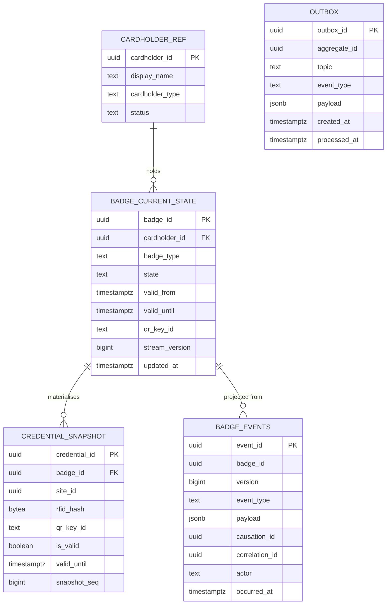

# Section 7 — Database Architecture

Engine: **Azure Database for PostgreSQL Flexible Server, PostgreSQL 18** — zone-redundant
HA in West Europe, geo read replica in North Europe. One database + role per service
(strict DB-per-service, Section 6.2). Production DDL lives in `db/` and is summarised here.

## 7.1 Why `uuidv7()` primary keys (vs `bigserial` / `uuidv4`)

- **vs `uuidv4`:** v4 keys are random → every insert lands in a random B-tree page →
  cache-hostile index churn on high-write tables (`badge_events`, `access_decisions`,
  `audit_events`). `uuidv7()` (native in PostgreSQL 18) is time-ordered → inserts append
  to the right-hand edge, indexes stay warm, and the PK doubles as a stable keyset-pagination
  cursor (ADR-018).
- **vs `bigserial`:** sequential integers leak volume/ordering to API clients, collide on
  multi-region active-active writes, and can't be generated client-side for idempotent
  retries. uuidv7 is globally unique without coordination — required for region-independent
  writes (Section 14.3).
- **Trade-off accepted:** 16 bytes vs 8; mitigated by fewer secondary indexes on hot tables.

## 7.2 ERD — Badge context

(`CARDHOLDER_REF` is a *local replica* maintained from `ams.cardholder` events — not a
foreign-key into another service's database.)

## 7.3 Production DDL

Authoritative files (PostgreSQL 18, apply in order):

| File | Contents |
|---|---|
| `db/001_badge_schema.sql` | Badge event store (append-only), current-state & snapshot read models, uuidv7 PKs, transition-guard trigger |
| `db/002_partitioning.sql` | Monthly range partitions for `access_decisions` + automation function |
| `db/003_outbox.sql` | Transactional outbox + idempotent-consumer inbox |
| `db/004_audit_worm.sql` | Append-only audit schema, INSERT-only role, retention & pseudonymisation hooks |

Key design points (see files for full DDL):

- **Append-only enforcement in-engine:** event/audit tables `REVOKE UPDATE, DELETE` from
  every application role; a `BEFORE UPDATE OR DELETE` trigger raises as defence-in-depth.
- **Optimistic concurrency:** `UNIQUE (badge_id, version)` on `badge_events`; writers
  insert `expectedVersion + 1` and translate unique-violation into a 409 retry.
- **Partitioning:** `access_decisions` and `audit_events` are `PARTITION BY RANGE
  (occurred_at)` with monthly partitions, created 3 months ahead by a scheduled function;
  detach-and-archive after the online-retention window.
- **JSONB payloads** with GIN indexes only on the audit search columns actually queried
  (subject_id, action) — not blanket GIN (write-amplification discipline).

## 7.4 Retention & archival (ties to GDPR + Section 8.6 classification)

| Data | Class | Online (PG) | Archive (WORM blob) | End of life |
|---|---|---|---|---|
| Access decisions | Confidential | 13 months (hot partitions) | 7 years (immutable, time-based retention policy) | Deleted after 7 y unless legal hold |
| Audit events | Confidential | 13 months | 7 years WORM | Same |
| Badge event streams | Confidential | Life of badge + 13 months | 7 years WORM | Same |
| Visitor PII | Restricted (PII) | Visit + 90 days, then **pseudonymised** (FR-050) | Pseudonymised envelopes only | Erasure workflow on data-subject request ≤ 30 days |
| Cardholder PII | Restricted (PII) | Employment/contract + 90 days, then pseudonymised | Pseudonymised only | Per legal-entity retention schedule |
| Notification payloads | Internal | 30 days | none | Auto-purged |
| Reporting marts | Internal | Rebuildable; 25 months | none | Rebuilt on demand |

Pseudonymisation replaces PII columns with a keyed reference into a separately-encrypted
identity vault table; audit-trail integrity survives erasure because envelopes reference
the pseudonym, never raw PII (Privacy by Design).

## 7.5 Backup, RPO/RTO, geo-redundancy

| Store | Mechanism | RPO | RTO |
|---|---|---|---|
| PostgreSQL (all service DBs) | Zone-redundant HA (sync standby) + PITR WAL archiving + geo-redundant backup to North Europe | **≤ 5 min** (geo), ~0 within region | **≤ 30 min** critical-path DBs (promote replica, scripted runbook); ≤ 4 h full estate |
| Audit WORM blob | RA-GZRS immutable containers, time-based retention lock | **0** (synchronous write is the ingestion contract; blob geo-replication lag is the only exposure and audit remains in PG until replicated) | ≤ 1 h (read from secondary) |
| Event Hubs | Capture-to-blob (Avro) per hub, geo-paired namespace | ≤ 5 min (capture window) | consumer replay from capture |
| Redis | Rebuildable cache — no backup; warm-up runbook | n/a | ≤ 10 min warm-up |

Quarterly restore drills are mandatory (Section 16 DoD): a backup that has never been
restored is a hypothesis, not a control.

## 7.6 Event store, outbox, audit schemas

- **Event store** (`db/001`): single `badge_events` table per event-sourced context —
  stream = `badge_id`, order = `version`, global order = `event_id` (uuidv7). Projections
  track a watermark (`last_event_id`) and are rebuildable.
- **Outbox** (`db/003`): same-transaction insert with state change (ADR-019); dispatcher
  selects `WHERE processed_at IS NULL ORDER BY outbox_id LIMIT batch FOR UPDATE SKIP LOCKED`
  — multiple dispatchers scale without double-send beyond at-least-once.
- **Inbox** (`db/003`): consumer-side `processed_events (event_id PK, processed_at)`
  gives exactly-once *effect* on top of at-least-once delivery.
- **Audit WORM** (`db/004`): INSERT-only role; monthly partitions; nightly job computes a
  Merkle root per closed partition (`audit_partition_digests`) — the ADR-020/blockchain
  seam and a tamper-evidence control today.

<!-- SECTION 7 COMPLETE -->
