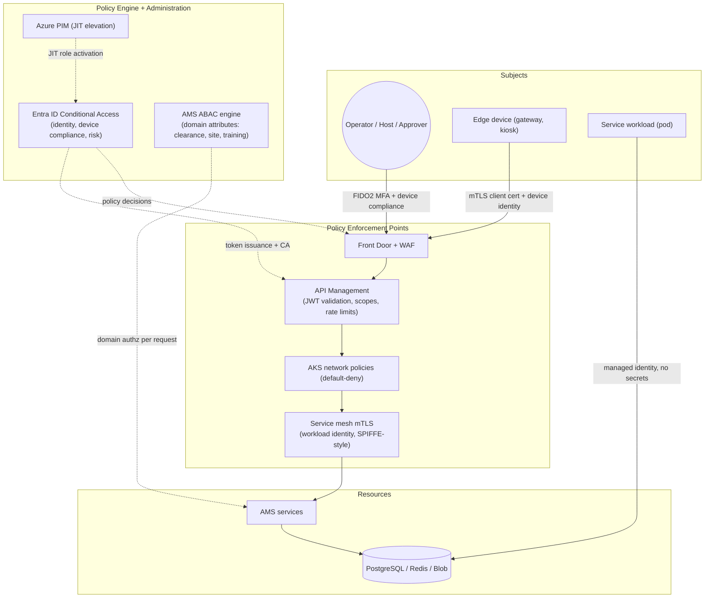

# Section 8 — Security Architecture

Principles: **Zero Trust** (NIST SP 800-207), **Secure by Design** (least privilege, JIT),
**Privacy by Design** (classification, minimisation, encryption everywhere).

## 8.1 Zero Trust architecture



Trust is established per request from **identity + device + context**, never network
location. Assume breach: east-west traffic is default-deny; every service authenticates
to every dependency with workload identity; blast radius of any single pod compromise is
its own DB role and topic ACLs.

## 8.2 RBAC matrix (role × permission)

| Permission \\ Role | Visitor | Host | Receptionist | Security Officer | SOC Lead | Area Owner | Site Admin | Compliance Auditor | Platform Admin |
|---|---|---|---|---|---|---|---|---|---|
| Pre-register visit | — | ✔ | ✔ | ✔ | ✔ | ✔ | ✔ | — | — |
| Check in/out visitor | self (kiosk) | — | ✔ | ✔ | ✔ | — | ✔ | — | — |
| Issue/replace badge | — | — | visitor badges only | ✔ | ✔ | — | ✔ | — | — |
| Revoke badge | — | — | — | ✔ | ✔ | — | ✔ | — | — |
| Approve area access | — | — | — | — | — | ✔ (owned areas) | — | — | — |
| Delegate approval | — | — | — | — | — | ✔ | — | — | — |
| Manage policies/grants | — | — | — | propose | ✔ | owned areas | site scope | — | — |
| View live occupancy | — | — | site lobby | ✔ | ✔ | owned areas | ✔ | — | — |
| Trigger evacuation mode | — | — | — | ✔ | ✔ | — | ✔ | — | — |
| Query audit evidence | — | — | — | own site | ✔ | owned areas | own site | ✔ (all, read-only) | — |
| Manage watchlist | — | — | — | ✔ | ✔ | — | — | — | — |
| Manage sites/devices | — | — | — | — | — | — | ✔ | — | ✔ |
| Platform/infra operations | — | — | — | — | — | — | — | — | ✔ (JIT via PIM only) |

All operator roles are Entra security groups; Platform Admin is **eligible-only** (PIM
activation with approval + MFA, max 8 h). No standing admin access anywhere.

## 8.3 ABAC policy examples

```json
{
  "policyId": "restricted-lab-entry",
  "description": "Entry to BSL-2 labs requires clearance, training, and business hours unless on-call",
  "effect": "permit",
  "target": { "resourceType": "zone", "zoneAttributes": { "classification": "Restricted", "category": "Laboratory" } },
  "condition": {
    "allOf": [
      { "attribute": "subject.clearanceLevel", "operator": "gte", "value": "Restricted" },
      { "attribute": "subject.trainings", "operator": "contains", "value": "LAB-SAFETY-2" },
      { "attribute": "subject.department", "operator": "in", "value": ["R&D", "QualityControl"] },
      { "anyOf": [
        { "attribute": "environment.localTime", "operator": "withinSchedule", "value": "business-hours" },
        { "attribute": "subject.onCallRoster", "operator": "contains", "value": "lab-oncall" }
      ]}
    ]
  },
  "obligations": [ { "type": "audit", "level": "elevated" } ]
}
```

```json
{
  "policyId": "finance-eu-restricted-records",
  "description": "Finance archive rooms: EU-region finance staff with Restricted clearance only",
  "effect": "permit",
  "target": { "resourceType": "zone", "zoneAttributes": { "owner": "Finance", "classification": "Restricted" } },
  "condition": {
    "allOf": [
      { "attribute": "subject.department", "operator": "eq", "value": "Finance" },
      { "attribute": "resource.site.region", "operator": "eq", "value": "EU" },
      { "attribute": "subject.clearanceLevel", "operator": "gte", "value": "Restricted" },
      { "attribute": "subject.contractWindow", "operator": "activeAt", "value": "now" }
    ]
  },
  "obligations": [ { "type": "twoPersonRule", "windowSeconds": 15 } ]
}
```

Policies are versioned documents (`policy.published` events); every decision records the
evaluated policy version (FR-040, FR-028).

## 8.4 STRIDE threat model — Visitor Check-in/Check-out

| Threat (STRIDE) | Scenario | Asset | Mitigations | Residual risk |
|---|---|---|---|---|
| **S**poofing | Stolen/forwarded QR invite used by impostor | Site entry | Signed single-use QR bound to visit window+site; identity confirmation at kiosk; photo capture option (FR-018); host arrival confirmation | **Low** — lookalike with victim's invite and ID slips reception at busy sites; drills + reception training |
| **T**ampering | QR payload modified to extend window/site | Access decision | Asymmetric signature (Key Vault, rotated); validator rejects unknown key IDs; no authorisation data trusted from the QR itself — it is a *reference*, server/edge resolves entitlements | **Very low** — requires signing-key compromise (HSM-held) |
| **R**epudiation | Visitor denies having been on-site; host denies approving | Audit evidence | Append-only decision log + WORM audit; approval events record actor+timestamp+policy version; kiosk document e-signature | **Very low** — kiosk shared-terminal ambiguity possible; camera correlation out of scope |
| **I**nformation disclosure | Visitor PII leaked via kiosk screen, logs, or over-broad API | Visitor PII (Restricted) | PII masking in logs (Section 13.2); kiosk shows minimal fields; ABAC-filtered APIs; 90-day pseudonymisation; TLS 1.3 everywhere | **Low** — shoulder-surfing at kiosk; privacy screens recommended per site |
| **D**enial of service | Kiosk/check-in API flooded at shift start or maliciously | Reception throughput | Front Door WAF rate rules; APIM per-client quotas; kiosk offline queue; reception-assisted fallback; autoscale on RPS | **Medium** — determined L7 flood degrades self-service to manual fallback; accepted with runbook |
| **E**levation of privilege | Visitor badge escalated to employee-grade access | Zones beyond lobby | Visitor badges map to visitor-profile grants only (escort-required zones deny); badge type immutable post-issue; anti-passback; alarms on repeated denies (FR-035) | **Low** — tailgating remains the physical bypass; mitigated by turnstiles/mantraps at Restricted zones (site build standard) |

## 8.5 Attack-surface analysis (external interfaces)

| Interface | Exposure | AuthN/AuthZ | Key controls | Risk rating |
|---|---|---|---|---|
| Public web app (host/visitor portal) | Internet | Entra ID OIDC + CA; visitors: signed invite links | WAF, CSP, rate limits, bot rules | Medium |
| Kiosk app | Site LAN → Front Door | Device cert + kiosk-mode OS hardening | mTLS, certificate pinning, no local PII persistence | Medium |
| Edge gateway API (gRPC/REST) | Site LAN → Front Door | mTLS device identity + short-lived tokens | Per-device authz, config signature verification, anomaly alerts on decision-rate deviation | **High-value target** → highest control density |
| Public REST API (`/v1/...`) | Internet (partner integrations) | OAuth2 client credentials, scopes, APIM quotas | Idempotency, RFC 7807 (no stack traces), schema validation, audit on every mutate | Medium |
| Webhooks (outbound) | AMS → customer endpoints | HMAC-SHA256 signature header (per-subscription secret in Key Vault), TLS-only URLs, retry w/ backoff | Egress allow-list, replay protection via timestamp+id | Low |
| Email invite links | Internet | Signed, single-use, expiring tokens | No PII in URL, revocable per visit | Low |
| Admin/SOC UI | Internet, CA-restricted | FIDO2 MFA mandatory + compliant device + PIM for privileged ops | Session limits, step-up auth for revocation/evacuation actions | Medium |
| CI/CD + GitOps plane | GitHub / ArgoCD | OIDC federation (no PATs), branch protection, environments with approvals | Secret scanning, SBOM, image signing, least-priv deploy identities | **High-value target** — supply-chain controls in Section 12 |

## 8.6 Data classification model

| Level | Examples | Handling rules |
|---|---|---|
| Public | Site addresses, generic instructions | No restrictions; integrity-protected |
| Internal | Zone names, device inventory, report templates | Entra-authenticated access; standard encryption |
| Confidential | Access decisions, audit envelopes, approval records | Role/ABAC-gated; encrypted; 7-y retention; export logged |
| Restricted | Cardholder/visitor PII, credential material, watchlists, evacuation medical flags | Field-level protection; pseudonymisation schedule; access individually audited; EU residency; no export without DPO-approved purpose |

## 8.7 Compliance mapping (every control × four frameworks)

Framework references are to control *families* per the anti-hallucination rule (exact
clause numbering verified against the certified statement of applicability at audit time).

| # | Control (implemented) | ISO 27001 (Annex A family) | SOC 2 (TSC) | GDPR (principle/right) | NIST CSF 2.0 |
|---|---|---|---|---|---|
| 1 | Phishing-resistant MFA (FIDO2) for all operators | Access control | CC6 (logical access) | Art. 32 security of processing | PR (identity & access) |
| 2 | RBAC + ABAC with policy versioning | Access control | CC6 | Art. 25 data protection by design | PR |
| 3 | JIT privileged access via PIM, no standing admin | Privileged access mgmt | CC6 | Art. 32 | PR / GV (roles & responsibilities) |
| 4 | mTLS TLS 1.3 everywhere; default-deny east-west | Communications security | CC6/CC7 | Art. 32 | PR |
| 5 | AES-256 at rest; HSM-held keys, rotation | Cryptography | CC6 | Art. 32 | PR |
| 6 | Append-only audit + WORM replication + Merkle digests | Logging & monitoring | CC7 (system ops) | Art. 5(2) accountability | DE (continuous monitoring) |
| 7 | ≤ 5 s credential revocation propagation | Access control / HR security | CC6 | Art. 32 | PR / RS (mitigation) |
| 8 | PII classification, minimisation, 90-day pseudonymisation | Information classification | CC3/P-series (privacy) | Art. 5(1)(c),(e) minimisation & storage limitation | GV / PR |
| 9 | Data-subject erasure workflow ≤ 30 days | Compliance | Privacy criteria | Art. 17 right to erasure | GV |
| 10 | Secret scanning gate (Gitleaks) + Key Vault-only secrets | Secure development | CC8 (change mgmt) | Art. 32 | PR / ID (asset mgmt) |
| 11 | SAST, container scan, SBOM, signed images in CI | Secure development / supplier | CC8 | Art. 32 | ID / PR |
| 12 | SIEM (Sentinel) correlation + SOC alerting | Incident management | CC7 | Art. 33 breach notification (detection input) | DE / RS |
| 13 | Multi-region DR, tested restores, RPO/RTO targets | Business continuity | A1 (availability) | Art. 32(1)(c) resilience | RC (recovery) |
| 14 | Access-review campaigns w/ auto-revocation (FR-052) | Access review | CC6 | Art. 5(1)(f) integrity & confidentiality | GV / ID |
| 15 | Risk register + error-budget governance (Sections 13/16) | Risk management (Clause 6 family) | CC3 (risk assessment) | Art. 35 DPIA (feeds) | **GV** (CSF 2.0 govern function) |

<!-- SECTION 8 COMPLETE -->
