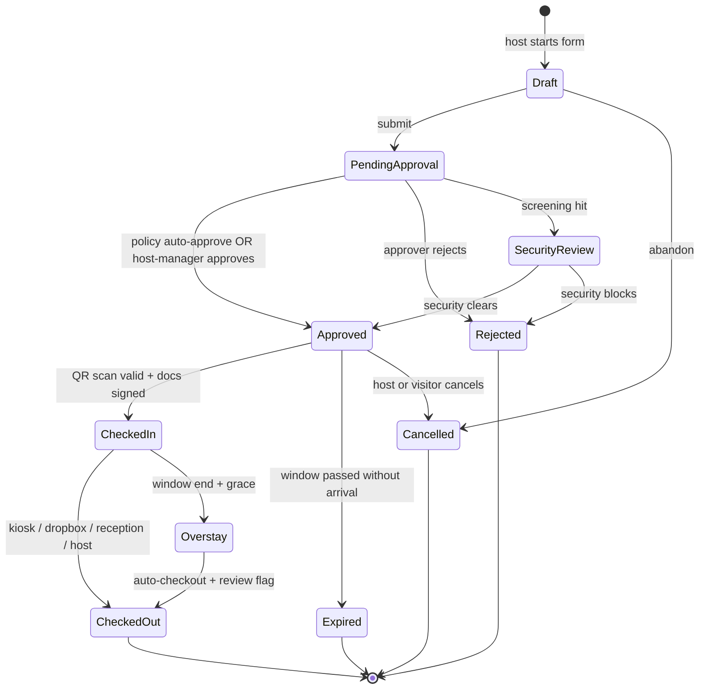
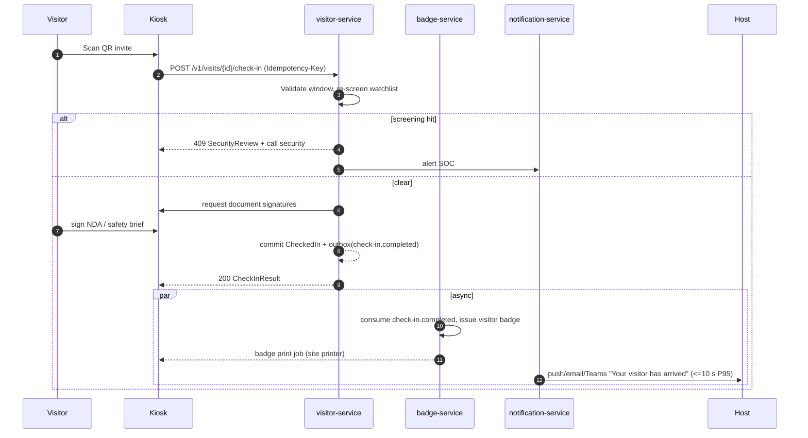
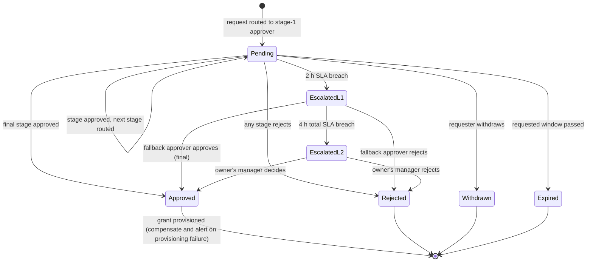
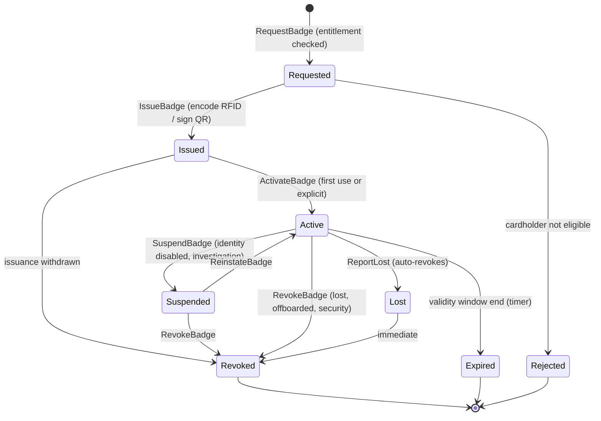
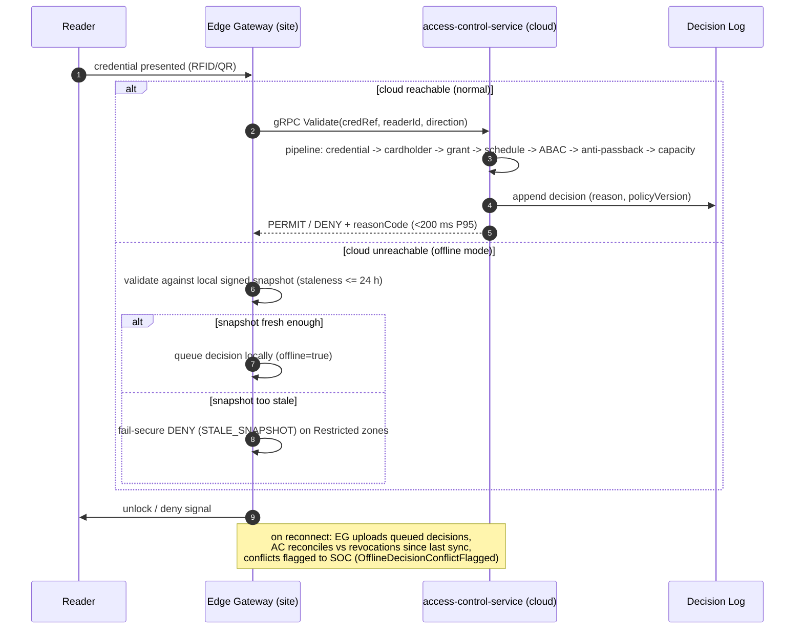
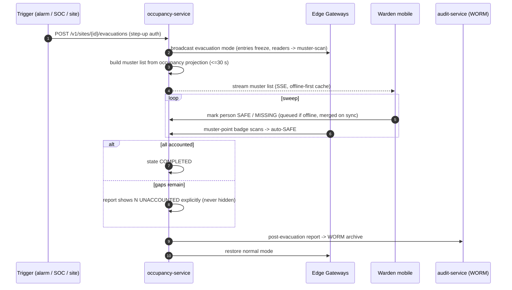

# Section 10 — Workflow Architecture

All state machines are authoritative: services reject transitions not shown here
(RFC 7807 `urn:ams:*:invalid-transition`). Error/exception paths are explicit.

## 10.1 Visitor pre-registration & check-in/out

**Exception paths:** kiosk offline → reception-assisted check-in against the same visit
record (edge-cached); badge printer failure → paper pass fallback + ops alert; QR
presented outside window → deny with `OUTSIDE_SCHEDULE`, offer reception; screening hit at
check-in (list updated since approval) → block + `SecurityReview` re-entry.

## 10.2 Approval routing, escalation & delegation

**Delegation:** an active delegation re-routes `Pending` items to the delegate for its
window; delegate decisions record both identities (`decidedBy`, `onBehalfOf`); delegates
cannot re-delegate (FR-038). **Failure:** grant-provisioning failure after final approval
retries 3× with backoff, then parks as `Granted-PendingProvisioning` with an ops alert —
approval outcome is never silently lost.

## 10.3 Badge issuance / replacement / revocation

Replacement (FR-023) is a single command producing `BadgeReplaced` which atomically
appends `BadgeRevoked(old)` + `BadgeIssued(new)` in one stream transaction — there is no
state where both validate. **Failures:** encoder/printer error keeps the badge `Issued`
(not `Active`) with retry queue; optimistic-concurrency conflict → one reload-retry then
409; Key Vault signing outage → QR issuance degrades (RFID unaffected), alert at 2 min.

## 10.4 Physical access validation (with offline-edge fallback)

## 10.5 Emergency evacuation mustering & reporting

**Exception paths:** cloud unreachable at trigger time → edge gateways can activate
evacuation mode site-locally and reconcile later (ADR-020); warden device offline →
local queue with last-writer-wins merge, "safe" wins ties; duplicate activation →
idempotent (single active evacuation per site, second POST returns the active one, 409
only if trigger conflicts).

<!-- SECTION 10 COMPLETE -->
