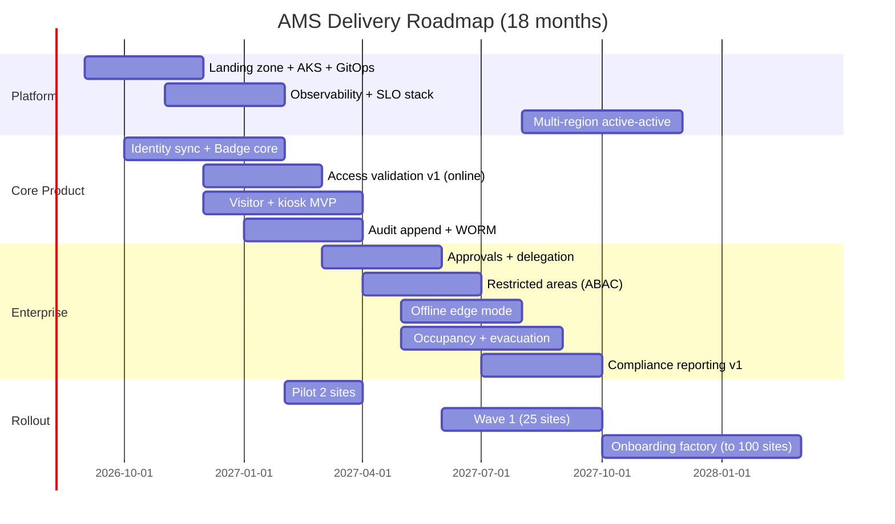

# Section 16 — Delivery Plan

## 16.1 Team topology (Team Topologies mapped to bounded contexts)

| Team | Type | Owns |
|---|---|---|
| Team Entry (8) | stream-aligned | Visitor + Notification contexts, kiosk UI |
| Team Credential (8) | stream-aligned | Badge + Identity contexts, self-service UI |
| Team Guard (9) | stream-aligned | Access Control + Occupancy/Evacuation, edge gateway, SOC UI |
| Team Governance (7) | stream-aligned | Approval + Audit + Reporting contexts, compliance UI |
| Platform Team (7) | platform | AKS, Terraform, GitOps, observability stack, golden paths (service template) |
| Enabling: Security & Compliance (4) | enabling | Threat modelling, control mapping, pen-test coordination, DPO liaison |
| Enabling: UX & Accessibility (3) | enabling | Design system, research, WCAG audits |

Interaction modes: stream teams consume the platform as a product (X-as-a-Service);
enabling teams rotate through stream teams (facilitating, time-boxed). Each stream team
owns its services end-to-end: build, deploy, on-call, SLOs (you-build-it-you-run-it).

## 16.2 Org / reporting lines

Head of Engineering → 4 stream-team engineering managers + Platform EM.
Head of Product → 2 product managers (Entry+Credential / Guard+Governance) + Staff PM (rollout).
CISO org → Security & Compliance enabling team (dotted line into programme).
Programme steering: Head Eng, Head Product, CISO delegate, Ops director — monthly,
owns the risk register and error-budget policy escalations.

## 16.3 Roadmap

- **Phase 1 — Foundation + MVP (months 1–6):** platform (AKS, GitOps, observability, CI/CD), Identity sync, Badge core, Access validation v1 (online only), Visitor pre-reg + kiosk check-in, audit append + WORM. **Milestone M6: 2 pilot sites live.**
- **Phase 2 — Enterprise capabilities (months 7–12):** approvals + delegation + escalation, restricted areas (ABAC), offline edge mode, occupancy + evacuation, compliance reporting v1, DR failover drill. **Milestone M12: 25 sites, SOC 2 evidence cycle passed on AMS controls.**
- **Phase 3 — Scale & global rollout (months 13–18):** onboarding factory (30 sites/month), multi-region active-active, access-review campaigns, group visits, performance hardening to future-scale numbers. **Milestone M18: 100 sites; rollout machine proven; remaining 400 sites proceed at run-rate through month 30.**

## 16.4 18-month Gantt

## 16.5 RACI (major deliverables)

| Deliverable | Stream team | Platform | Security/Compl. | Product | Steering |
|---|---|---|---|---|---|
| Service architecture & ADRs | **R/A** | C | C | C | I |
| Platform landing zone / IaC | C | **R/A** | C | I | I |
| Security controls & mapping | R | C | **A** (C-level sign-off) | I | I |
| SLO definitions & error budgets | **R** | C | I | C | **A** |
| Site onboarding wave plan | C | C | I | **R** | **A** |
| DR / evacuation drills | R | **R** | C | I | **A** |
| GDPR DPIA & retention config | C | I | **R** | C | **A** (DPO) |
| Release go/no-go (prod gate) | **R** | C | C | C | **A** |

## 16.6 RAID log (top entries)

- **Risks:** see register below.
- **Assumptions:** A1–A5 from Section 1.11 (peak multiplier, WAN redundancy, internal-only watchlists, readers/zone density, Entra P2 licensing).
- **Issues (day-1):** legacy controller protocol diversity at the 20 existing sites (site surveys required before edge design freeze); MediatR/Mapperly licence review (ADR-002).
- **Dependencies:** Entra ID tenant config (Conditional Access, PIM) owned by corporate IT; site network upgrades (dual uplink) owned by Facilities; badge-printer procurement lead time ~12 weeks; APIM/Front Door quotas confirmed with Azure account team.

## 16.7 Risk register (top 10)

| # | Risk | P | I | Score | Mitigation | Owner |
|---|---|---|---|---|---|---|
| 1 | Legacy hardware integration exceeds estimates | H | H | 9 | Site surveys in phase 1; edge abstraction layer; certified-hardware list for new sites | Team Guard EM |
| 2 | Site onboarding rate < 30/month stalls rollout | M | H | 6 | Onboarding factory playbook, dedicated rollout squad, wave buffers | Staff PM |
| 3 | Offline-edge correctness bugs permit revoked badges | M | H | 6 | Deny-precedence design, reconciliation reports, chaos-testing disconnects, SOC review of conflicts | Team Guard EM |
| 4 | GDPR erasure vs immutable audit conflict misdesigned | M | H | 6 | Pseudonymisation pattern (7.4) reviewed with DPO before phase 1 exit | Security lead |
| 5 | Peak-hour assumption (A1) wrong → undersized bursts | M | M | 4 | Load tests at 2× model; HPA headroom; measure pilots and re-baseline | Platform EM |
| 6 | Key-person loss in platform team | M | M | 4 | Pairing, runbooks, no single-owner components | Platform EM |
| 7 | PG 18 / early-cycle stack availability gaps | L | M | 3 | ADR-T11 fallback path (extension + planned upgrade); platform test env burn-in | Platform EM |
| 8 | Evacuation feature trusted beyond its design (life-safety) | L | H | 3 | Explicit "unaccounted" reporting, warden drills, certification review per site type | Product + Safety officer |
| 9 | Approval SLA culture fails (approvers ignore) | M | M | 4 | Escalation + delegation UX, manager dashboards, KPI in ops review | Product |
| 10 | Cloud cost overrun at scale | M | M | 4 | FinOps NFR-022, budget alerts, reserved capacity purchases at M12 | Platform EM + Finance |

(P/I: L/M/H; score = P×I on 1–3 scale.)

## 16.8 Staffing model

| Role | Count | Notes |
|---|---|---|
| Backend engineers (.NET) | 16 | 4 per stream team |
| Frontend engineers (React) | 8 | 2 per stream team |
| Platform/SRE engineers | 7 | AKS, IaC, observability, on-call tooling |
| Edge/embedded engineers | 3 | gateway, reader integrations (Team Guard) |
| QA / SDET | 6 | embedded, incl. load + chaos |
| Product managers | 3 | + 1 staff PM rollout |
| UX design + research | 3 | enabling team |
| Security engineers | 3 | + compliance analyst (1) |
| Engineering managers | 5 | |
| Data/DB specialist | 1 | PG partitioning, tuning, retention jobs |
| **Total** | **≈ 56** | Peak (phase 2–3); phase 1 ≈ 40 |

**Budget categories:** infrastructure (AKS, PG, Event Hubs, Redis, Front Door/APIM,
observability storage — Section 14 sizing feeds the forecast); licensing (Entra P2 uplift,
MediatR/component licences, monitoring SaaS if any); personnel (above headcount + on-call
allowance); training & certification (K8s, security, accessibility); hardware (badge
printers, kiosks, edge gateways per site wave); contingency 15 %.

## 16.9 Definition of Done

- **Story:** code + tests (unit ≥ 80 % on touched code) merged behind flag; a11y checks
  pass; logs/metrics/traces added; docs updated; no new SAST/secret findings.
- **Feature:** e2e tests green; SLO dashboards updated; threat-model delta reviewed;
  runbook entry; feature flag rollout plan; product sign-off in UAT.
- **Release:** canary passed; error budget healthy; compliance mapping updated if
  controls changed; rollback tested in the release train; release notes; evidence pack
  (SBOM, scan reports, approvals) archived 7 y.
- **Site onboarding (rollout DoD):** survey done, edge installed + offline drill passed,
  muster drill executed, reception trained, hypercare exit criteria met (2 weeks, no P1s).

<!-- SECTION 16 COMPLETE -->
