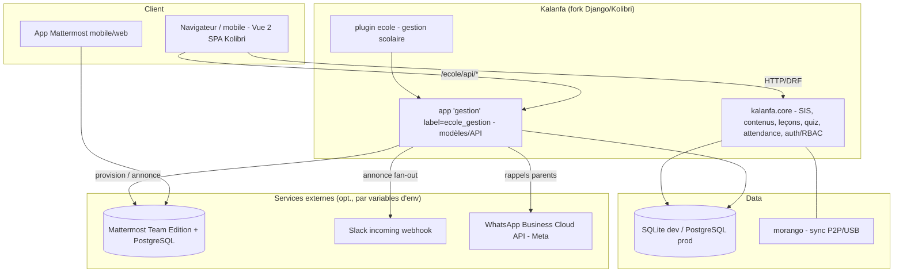
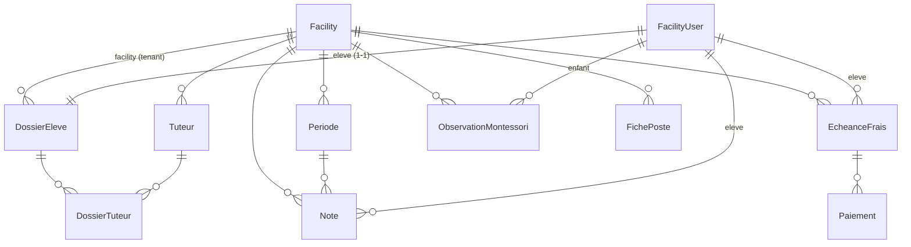
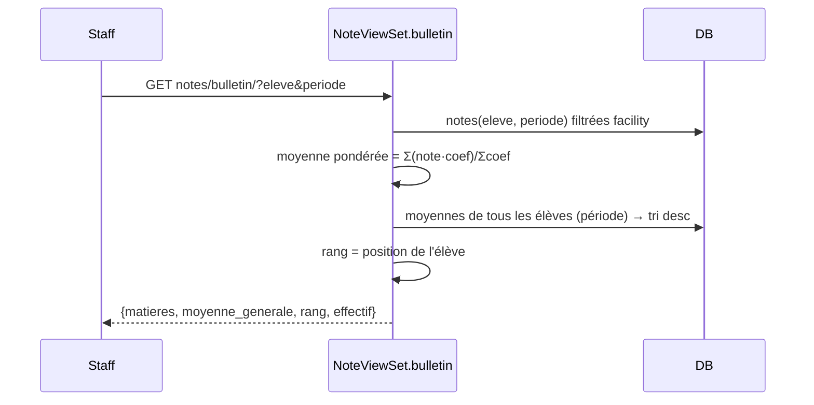

# PROJECT BLUEPRINT — Kalanfa (PROJET_SCHOOL_MOUMA_BKO_2026)

> Durable engineering knowledge package. Generated by the `export_project`
> skill after direct investigation of the repository at commit `2a2ab1d`
> (branch `claude/school-management-clone-uicab0`).
> Companion files: `PROJECT_CONTEXT.json`, `PROJECT_REBUILD_PROMPT.md`,
> `DECISION_LOG.md`, `DEVELOPMENT_STATE.md`. Business/product master prompt:
> `MASTER_PROMPT.md` / `.json` (v2.2.0).

**Evidence labels** — `[verified]` = observed in code/config/tests this pass;
`[reported]` = executed earlier in project history, not re-run here;
`[inferred]` = reasoned from evidence; `[recommendation]` = proposed, not built.

---

## 1. Executive summary

**Kalanfa** is a multi-tenant, **offline-first** school-management + digital-learning
**SaaS**, built as an independent **MIT fork of [Kolibri](https://github.com/learningequality/kolibri)**
(Learning Equality). It targets francophone West-African private schools —
piloted at **École MOUMA, Bamako (Mali)**, cycles Montessori/maternelle +
Collège, for the 2026 school year.

The learning platform (content channels, lessons, quizzes, coach dashboards,
peer-to-peer/USB sync) comes from Kolibri. On top, a custom Django plugin
**`kalanfa.plugins.ecole`** adds francophone school-management modules:
inscriptions (fiches de renseignement), notes & bulletins, frais de scolarité
(FCFA), Montessori observations, fiches de poste — plus a **messaging** layer
(self-hosted Mattermost) with **Slack** and **WhatsApp** connectors.

The tenant boundary reuses Kolibri's **Facility** concept: one facility = one
school. Every school-management record is facility-scoped; cross-school access
is denied. `[verified]`

---

## 2. Product

- **Problem** — francophone private schools run inscriptions, grades, report
  cards, fees and pedagogy on paper/spreadsheets; unpaid fees poorly tracked;
  slow report cards; no structured Montessori tracking; expensive/intermittent
  Internet breaks cloud-only SaaS.
- **Users / roles** — super-admin (platform), admin établissement (direction),
  coach/enseignant, apprenant/élève, parent (read portal — `[recommendation]`,
  spec'd not built).
- **Core value** — offline-first + multi-tenant + French school workflows
  (bulletins à la malienne) + integrated Kolibri learning. Differentiator is
  explicitly framed as a **hypothesis to validate** (see `MASTER_PROMPT`).
- **Locale** — French UI, XOF (FCFA), `Africa/Bamako`. `[verified]`

---

## 3. Architecture



- **Backend** — Python / **Django 3.2** + Django REST Framework + **morango**
  (offline sync). `[verified]` (from `pyproject.toml` base group)
- **Frontend** — **Vue 2**, pnpm monorepo, webpack; Kolibri Design System.
  `[verified]` (29 bundles build clean `[reported]`)
- **DB** — SQLite (dev) → PostgreSQL (prod). `[verified]`
- **Packaging** — `kalanfa` Python package (renamed from `kolibri`), CLI
  entry point `kalanfa = kalanfa.utils.cli:main`, plugin entry points under
  `kalanfa.plugins`. `[verified]`

### Plugin architecture (critical detail)

Kolibri assigns plugins a **dotted Django `app_label`** (`kalanfa.plugins.ecole`),
which breaks migrations for relational fields (`ValueError: too many values to
unpack`). Therefore the data layer lives in a **nested ordinary Django app**
`gestion` (label `ecole_gestion`), registered via the plugin's `settings.py`
(`INSTALLED_APPS = ["kalanfa.plugins.ecole.gestion.apps.GestionConfig"]`). The
tutor↔dossier link uses an **explicit junction model** (`DossierTuteur`) instead
of a `ManyToManyField` for the same reason. `[verified]`

---

## 4. Repository organization

| Path | Purpose |
|---|---|
| `kalanfa/` (repo subdir = the product) | The Kalanfa fork + all deliverables |
| `kalanfa/kalanfa/` | Renamed Kolibri Python package (`core`, `plugins`, `deployment`, …) |
| `kalanfa/kalanfa/plugins/ecole/` | School-management plugin (shell: `api_urls.py`, `settings.py`, `kalanfa_plugin.py`) |
| `kalanfa/kalanfa/plugins/ecole/gestion/` | Data app: `models.py`, `serializers.py`, `viewsets.py`, `messagerie.py`, `connecteurs.py`, `migrations/`, `management/commands/`, `test/` |
| `kalanfa/packages/` | Vue/JS monorepo workspaces (renamed) |
| `kalanfa/deployment/messagerie/` | Mattermost `docker-compose.yml` |
| `kalanfa/docs/adr/` | Architecture Decision Records (ADR-006 messaging) |
| `kalanfa/MASTER_PROMPT.{md,json}` | Business+product reverse master prompt (v2.2.0) |
| `kalanfa/LICENSE`, `ATTRIBUTION.md`, `UPSTREAM_KOLIBRI_*` | MIT attribution to Learning Equality |

`[verified]`

---

## 5. Domain model (plugin `ecole`, app `ecole_gestion`)



Base mixins: `UUIDPrimaryKeyModel` (UUID pk), `EtablissementScopedModel`
(adds `facility` FK + `date_creation`/`date_modification`). Concrete models
(`[verified]`): **DossierEleve** (état civil, santé, scolarité antérieure,
bourse/réduction), **Tuteur** + **DossierTuteur** (junction), **Periode**
(année scolaire + trimestre), **Note** (/20, coefficient, période, matière),
**EcheanceFrais** + **Paiement** (FCFA integers; `solde`/`montant_paye`
computed), **ObservationMontessori** (5 domaines × 4 niveaux d'acquisition),
**FichePoste**. Enums: `Sexe`, `LienParente`, `DomaineMontessori`,
`NiveauAcquisition`.

---

## 6. APIs (mounted at `/ecole/api/`, namespace `kalanfa:kalanfa.plugins.ecole`)

| Route | Method | Auth | Purpose |
|---|---|---|---|
| `dossiers/` | CRUD | membre; write=staff | Fiches de renseignement |
| `tuteurs/` | CRUD | idem | Parents/tuteurs |
| `periodes/` | CRUD | idem | Périodes d'évaluation |
| `notes/` | CRUD + `bulletin/` | idem | Notes ; `bulletin/?eleve=&periode=` → moyenne pondérée, rang, effectif |
| `frais/` | CRUD + `impayes/` | idem | Échéances ; `impayes/` → soldes positifs |
| `paiements/` | CRUD | idem | Paiements/reçus |
| `observations/` | CRUD + `progression/` | idem | Montessori ; `progression/?enfant=` → synthèse par domaine |
| `fiches-poste/` | CRUD | idem | Fiches de poste |
| `messagerie/annonce/` | POST | staff | Annonce → fan-out Mattermost + Slack |
| `messagerie/whatsapp/` | POST | staff | Message WhatsApp (texte 24 h ou template) |

**Access model** (`EstMembreEtablissement` + `EcoleBaseViewSet`): authenticated
facility members read; only admin/coach of the facility (or device superuser)
write; every queryset filtered to `request.user.facility`; create force-assigns
that facility. Cross-facility detail → 404. `[verified]` by tests.

### Bulletin flow



---

## 7. Messaging & connectors

- **Mattermost** (`gestion/messagerie.py`) — minimal REST v4 client. One
  invite-only **team per facility**; default channels `annonces` (open),
  `enseignants`, `direction` (private); idempotent user provisioning with
  generated passwords. Command `kalanfa manage provisionmessagerie
  --etablissement <nom>`. Deploy via `deployment/messagerie/docker-compose.yml`.
- **Slack** (`gestion/connecteurs.py::SlackConnector`) — incoming webhook;
  announcement relay.
- **WhatsApp** (`::WhatsAppConnector`) — Meta Graph v20 Cloud API; free text
  (24 h window) or pre-approved templates (outbound reminders); Malian phone
  normalization.
- **Config** (env only, never in repo): `KALANFA_MATTERMOST_URL/TOKEN`,
  `KALANFA_SLACK_WEBHOOK_URL`, `KALANFA_WHATSAPP_TOKEN/PHONE_ID`. `[verified]`
- Decision + alternatives (Zulip/Rocket.Chat/Matrix): `docs/adr/ADR-006-messagerie.md`.

---

## 8. Security

- Session auth (Kolibri) + **RBAC per role and per facility**; DRF validation;
  staff-only writes; secrets via env; onboarding passwords ≥ 8 chars; generated
  Mattermost passwords via `secrets`. `[verified]`
- Upstream telemetry (`telemetry.learningequality.org`) still present →
  **must be neutralized in production**. `[verified]` (seen in boot logs)
- External-service failures degrade to HTTP 502 with clean messages; no secret
  leakage in errors (truncated). `[verified]`

---

## 9. Testing

`gestion/test/` — **29 tests passing** `[reported]` (Django/pytest, external
APIs mocked): `test_api.py` (tenant isolation, role gating, bulletin math
13.8/20 rang 2), `test_messagerie.py` (Mattermost idempotence, slug, config,
annonce access), `test_connecteurs.py` (Slack/WhatsApp payloads, number
normalization, endpoint access). Run: `KALANFA_PLUGIN_APPLY=kalanfa.plugins.ecole
python -m pytest kalanfa/plugins/ecole/gestion/test/`.

---

## 10. Deployment & build

- **Install** — `SETUPTOOLS_SCM_PRETEND_VERSION_FOR_KALANFA=0.1.0 pip install
  -e . --no-deps`; deps from `pyproject.toml` `base` dependency-group.
- **Frontend** — `pnpm install` then `pnpm build` **with the venv Python active**
  (build shells out to `python` for plugin discovery). npm aliases:
  `kalanfa-constants`/`kalanfa-design-system` → upstream `kolibri-*`;
  packageExtension injects `browserslist-config-kolibri`.
- **Run** — `kalanfa manage migrate` then `kalanfa start --foreground`;
  `kalanfa manage provisiondevice --facility "École MOUMA" --preset formal
  --language_id fr-fr`. `[reported: serves HTTP 200 at /fr-fr/auth/]`
- **Onboarding** — `kalanfa manage createschool --nom … --admin … --motdepasse
  … --preset formal`. `[verified]`

See `DECISION_LOG.md` for the six rebrand/build pitfalls and their fixes.

---

## 11. LLM knowledge summary (dense)

Kalanfa = MIT fork of Kolibri (Django 3.2 + DRF + morango + Vue 2), rebranded
kolibri→kalanfa across ~930 paths / ~3078 files. Product: offline-first
multi-tenant school SaaS for francophone West Africa; pilot École MOUMA Bamako.
Tenant = Kolibri **Facility**. Custom plugin `kalanfa.plugins.ecole` holds a
nested Django app `gestion` (label `ecole_gestion`) because Kolibri's dotted
plugin app_label breaks relational migrations. 9 concrete models (UUID pk, FK
facility): DossierEleve, Tuteur, DossierTuteur(junction), Periode, Note,
EcheanceFrais, Paiement, ObservationMontessori, FichePoste. DRF API at
`/ecole/api/` with facility-scoped querysets, staff-only writes, and custom
actions bulletin/impayes/progression. Messaging: self-hosted Mattermost (team
per facility), + Slack webhook + WhatsApp Cloud API connectors, all env-config.
29 mocked tests green. Known gaps: Vue UI for school modules (API-only), PDF
bulletins/receipts, parent portal (spec'd), Orange Money, telemetry off,
production deploy, importing real Drive docs before freezing schema. Roadmap
P0 (reproducible audit vs Kolibri 0.19.4) → P4 (payments + pilot). Rules:
planning-first, verify-really (migrate+test+boot), French-first, offline-first,
secure-by-default, keep MIT attribution.
```
```
