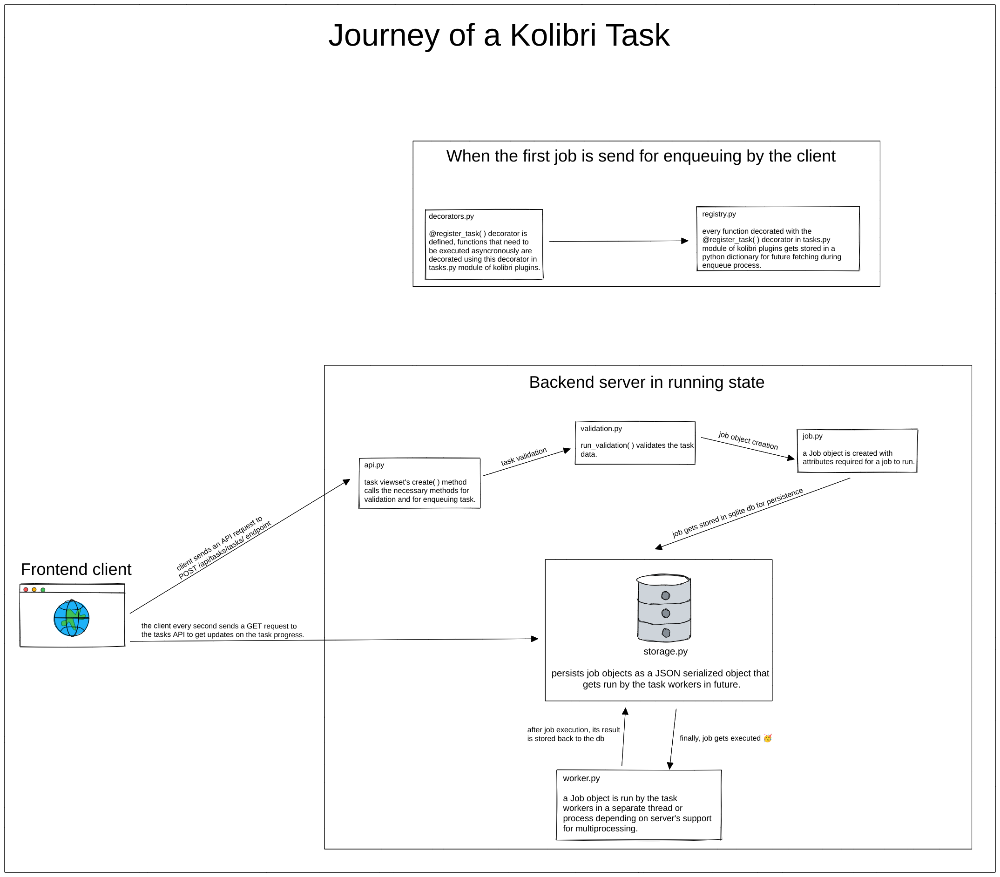

Kalanfa backend tasks system
=============================

Kalanfa plugins and Django apps can use the backend tasks system to run time consuming processes asynchronously outside of the HTTP request-response cycle. This frees the HTTP server for client use.

The kalanfa task system is implemented as a core Django app on ``kalanfa.core.tasks``.

Kalanfa backend tasks system flow diagram
-------------------------------------------

The following diagram explains how a task travels from the frontend client to the different parts of the backend task system. It aims to give a high level understanding of the backend tasks system.

You should download the following image to be able to zoom it in your image viewer. You can download by right clicking on following image and select "save image as" option.

.. Source: https://excalidraw.com/#json=9BxddPx20iBU_h-ObWkIM,h7ak9SCcy1fHn-4Pw6M0tg

Defining tasks via ``@register_task`` decorator
------------------------------------------------

When Kalanfa starts, the task backend searches for a module named ``tasks.py`` in every Django app and imports them, which results in the registration of tasks defined within.

When the ``tasks.py`` module gets run, functions decorated with ``@register_task`` decorator gets registered in the ``JobRegistry``.

The ``@register_task`` decorator is implemented in ``kalanfa.core.tasks.decorators``. It registers the decorated function as a task to the task backend system.

Kalanfa plugins and kalanfa's Django apps can pass several arguments to the decorator based on their needs.

- ``job_id (string)``: job's id.
- ``queue (string)``: queue in which the job should be enqueued.
- ``validator (callable)``: validator for the job. The details of how validation works is described later.
- ``priority (5 or 10)``: priority of the job. It can be ``"HIGH"`` (``5``) or ``"REGULAR"``(``10``). ``"REGULAR"`` priority is for tasks that can wait for some time before it actually starts executing. Tasks that are shown to users in the task manager should use ``"REGULAR"`` priority. ``"HIGH"`` priority is used for tasks that need execution as soon as possible. These are often short-lived tasks that temporarily block user interaction using a loading animation (for example, tasks that import channel metadata before browsing).
- ``cancellable (boolean)``: whether the job is cancellable or not.
- ``track_progress (boolean)``: whether to track progress of the job or not.
- ``permission_classes (Django Rest Framework's permission classes)``: a list of DRF permissions user should have in order to enqueue the job.

Example usage
~~~~~~~~~~~~~~

The below code sample shows how we can use the ``@register_task`` decorator to register a function as a task.

We will refer to below sample code in the later sections also.

.. code-block:: python

    from rest_framework import serializers

    from kalanfa.core.tasks.decorators import register_task
    from kalanfa.core.tasks.job import Priority
    from kalanfa.core.tasks.permissions import IsSuperAdmin
    from kalanfa.core.tasks.validation import JobValidator

    class AddValidator(JobValidator):
        a = serializers.IntegerField()
        b = serializers.IntegerField()

        def validate(self, data):
            if data['a'] + data['b'] > 100:
                raise serializers.ValidationError("Sum of a and b should be less than 100")
            job_data = super(AddValidator, self).validate(data)
            job_data["extra_metadata"].update({"user": "kalanfa"})
            return job_data

    @register_task(job_id="02", queue="maths", validator=AddValidator, priority=Priority.HIGH, cancellable=False, track_progress=True, permission_classes=[IsSuperAdmin])
    def add(a, b):
        return a + b

Enqueuing tasks via the ``POST /api/tasks/tasks/`` API endpoint
-----------------------------------------------------------------

To enqueue a task that is registered with the ``@register_task`` decorator we use ``POST /api/tasks/tasks/`` endpoint method defined on ``kalanfa.core.tasks.api.BaseViewSet.create``.

The request payload for ``POST /api/tasks/tasks/`` API endpoint should have:

- ``"type" (required)`` having value as string representing the dotted path to the function registered via the ``@register_task`` decorator.
- other key value pairs as per client's choice.

A valid request payload can be:

.. code-block:: python

    {
      "type": "kalanfa.core.content.tasks.add",
      "a": 45,
      "b": 49
    }

A successful response looks like this:

.. code-block:: python

    {
      "status": "QUEUED",
      "exception": "",
      "traceback": "",
      "percentage": 0,
      "id": 1,
      "cancellable": False,
      "clearable": False,
    }

When we send a request to ``POST /api/tasks/tasks/`` API endpoint, first, we validate the payload. The request
payload **must** have a ``"type"`` parameter as string and the user should have the permissions mentioned on the
``permission_classes`` argument of decorator. If the user has permissions then we proceed.

Then, we check whether the registered task function has a validator associated with it or not. If it has a validator, it
gets run. The return value of the validator must be a dictionary that conforms to the function signature of the Job object.
The dictionary returned by the validator is passed to a Job object to be enqueued. By default, any key value pairs in the
request object that are registered as input fields on the validator will be passed to the function as kwargs. If no fields
are defined on the validator, or no validator is registered, then the function will receive no arguments.

We can add ``extra_metadata`` in the returning dictionary of validator function to set extra metadata for the job. If the validator raises
any exception, our API endpoint method will re raise it. Keep in mind that ``extra_metadata`` is **not** passed to the task function as an argument.

For example, if the validator returns a dictionary like:

.. code-block:: python

    {
      "kwargs" : {
          "a": req_data["a"],
          "b": req_data["b"],
      },
      "extra_metadata": {
        "user": "kalanfa"
      }
    }

The task function will receive ``a`` and ``b`` as keyword arguments.

Once the validator is run and no exceptions are raised, we enqueue the ``"task"`` function. Depending on the
``priority`` of the task, the worker pool will run the task.

We can also enqueue tasks in bulk. The frontend just have to send a list of tasks, like:

.. code-block:: python

    [
      {
        "type": "kalanfa.core.content.tasks.add",
        "a": 45,
        "b": 49
      },
      {
        "type": "kalanfa.core.content.tasks.add",
        "a": 20,
        "b": 52
      },
      {
        "type": "kalanfa.core.content.tasks.subtract",
        "a": 10,
        "b": 59
      }
    ]

The tasks backend will iterate over this list and it will perform the operations of a task on every ``"type"`` function -- checking permissions, running the validator and enqueuing the task function.

The response will be a list of enqueued jobs like:

.. code-block:: python

    [
      {
        "status": "QUEUED",
        "exception": "",
        "traceback": "",
        "percentage": 0,
        "id": "e05ad2b3-eae8-4e29-9f00-b16accfee3e2",
        "cancellable": False,
        "clearable": False,
      },
      {
        "status": "QUEUED",
        "exception": "",
        "traceback": "",
        "percentage": 0,
        "id": "329f0fe0-bfb0-47f8-9e33-0468ef9805e5",
        "cancellable": False,
        "clearable": False,
      },
      {
        "status": "QUEUED",
        "exception": "",
        "traceback": "",
        "percentage": 0,
        "id": "895a881a-6825-4be0-8bd4-0e8db40ab324",
        "cancellable": False,
        "clearable": False,
      }
    ]

However, if any task fails validation, all tasks in the request will be rejected. Validation happens prior to enqueuing, so tasks will not be partially started in the bulk case.

Job execution and worker supervision
------------------------------------

Enqueued jobs are persisted in the job storage database (``kalanfa.core.tasks.storage``) and executed by a ``WorkerSupervisor`` (``kalanfa.core.tasks.worker``). Each supervisor runs a job checker thread that claims the next eligible ``QUEUED`` job and dispatches it to a thread pool of worker executors. Several supervisors - in separate processes, or on separate hosts sharing a postgres database - can serve the same job storage concurrently; the claim is made exactly once because it is serialized at the database level (``SELECT ... FOR UPDATE SKIP LOCKED`` on postgres, ``BEGIN IMMEDIATE`` transactions on SQLite).

On Android there is no ``WorkerSupervisor``; the platform's WorkManager dispatches executions directly through ``execute_job``, passing its own ``supervisor_id``.

Job ownership
~~~~~~~~~~~~~

While a job is in one of the supervised states - ``SELECTED``, ``RUNNING`` or ``CANCELING`` - it is owned by the supervisor responsible for its execution, recorded as ``supervisor_id`` on the job row. Ownership is stamped in the same database update that claims the job, and cleared again when the job reaches a terminal state or is requeued. Supervisors restrict themselves to their own jobs: a supervisor only cancels and finalizes jobs it owns (plus unowned ``CANCELING`` jobs, which were canceled before pickup and are idempotent to finalize).

Supervisor liveness and reconciliation
~~~~~~~~~~~~~~~~~~~~~~~~~~~~~~~~~~~~~~

A supervisor that dies leaves its jobs stuck in supervised states, so each supervisor registers itself in a supervisor registry and updates a heartbeat timestamp at a third of the ``SUPERVISOR_STALE_THRESHOLD`` interval (a ``Tasks`` option, 30 seconds by default - three heartbeats must be missed before a supervisor is considered dead). Heartbeats are written and compared using database time, so liveness never depends on clock synchronization between processes or hosts.

On startup and on every heartbeat, each supervisor reconciles stalled jobs: ``SELECTED`` and ``RUNNING`` jobs whose owner has no fresh heartbeat (or no owner at all) are requeued, and such ``CANCELING`` jobs are finalized as ``CANCELED``, since their owner can never finalize them. On Android, where WorkManager already knows which dispatchers are alive, reconciliation is instead passed the live set explicitly.

A supervisor can be *wrongly* declared dead - for example when its heartbeat thread is delayed - while its execution is still running. Its heartbeat re-registers it, but its jobs may already have been requeued and reclaimed by a peer. Execution is therefore **at least once**, and task functions should be written to be idempotent.

Ownership fencing
~~~~~~~~~~~~~~~~~

To keep the at-least-once overlap from corrupting job state, every storage write made from a job execution carries the execution's ``supervisor_id`` as the expected owner. The comparison happens under a row lock, atomically with the write: if the job is no longer owned by the writer's supervisor - it was requeued, or reclaimed by a peer - the write is discarded and logged, so the disowned execution cannot overwrite the newer state, and its completion cannot reschedule a repeating job into a duplicate run. Ownership loss is also treated as a cancel signal, so a disowned cancellable execution stops at its next cancellation checkpoint rather than running a duplicate to completion.

Writes made outside of an execution - for example API code updating a job's metadata - carry no expected owner and are unaffected by the fence.
