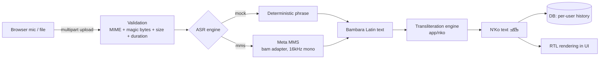

# Architecture

## Pipeline

## Components

| Component | Location | Notes |
|---|---|---|
| FastAPI app factory | `app/main.py` | lifespan boot: config → logging → DB → ASR engine |
| Config | `app/config.py` | pydantic-settings, `NKO_` env prefix, fail-fast validation |
| ASR interface | `app/asr/base.py` | `ASREngine` ABC + audio validation + factory |
| MMS engine | `app/asr/mms.py` | lazy, thread-safe model load; 16 kHz mono resample; CTC decode |
| Mock engine | `app/asr/mock.py` | content-hash → stable Bambara phrase |
| Transliteration | `app/nko/` | tables + rule engine (longest-match, coda-nasal detection) |
| Auth | `app/security.py` | Argon2id passwords, HS256 JWT (60 min default) |
| Persistence | `app/db.py`, `app/models.py` | SQLAlchemy 2.x; SQLite dev / PostgreSQL prod |
| Rate limiting | `app/limits.py` | slowapi per-IP; stricter on auth + transcribe |
| Frontend | `app/static/` | no build step; MediaRecorder; RTL N'Ko display |

## Key decisions

**Two-stage transcription.** No production ASR model outputs N'Ko directly.
MMS transcribes Bambara into Latin orthography (which uses `ɛ ɔ ɲ ŋ` —
exactly our transliteration input alphabet); a deterministic rule engine
converts to N'Ko. This split keeps the linguistically hard part (the rules)
100% testable and the ML part swappable.

**Engine behind an interface.** `mock` keeps every environment (CI, review
apps, this repo's tests) fully runnable without a ~2 GB torch stack; `mms`
loads lazily on first request so startup stays fast. Engine choice is
config, not code.

**Latin text is the source of truth, N'Ko is derived** — both are stored so
the transliteration engine can be improved and history re-derived later.

**No frontend build toolchain.** Vanilla JS + CSS served by FastAPI keeps the
deploy surface one container. The UI is small enough that a framework would
add cost without benefit.

## Scaling path

The API is stateless (JWT, no server sessions): scale horizontally behind a
load balancer. The MMS model is the bottleneck — next steps in order:
1. move ASR to a worker queue (the `ASREngine` seam is where the producer goes),
2. GPU inference for MMS,
3. object storage if raw audio retention is ever needed (currently audio is
   processed in memory and discarded — see SECURITY.md).

## Known limitations

* MMS Bambara accuracy is research-grade; treat output as a draft.
* Standard Bambara Latin orthography carries no tone marks, so the N'Ko
  output omits tone/length diacritics a native writer would add.
* SQLAlchemy `create_all` bootstraps the schema; introduce Alembic migrations
  before the first schema change in production.
