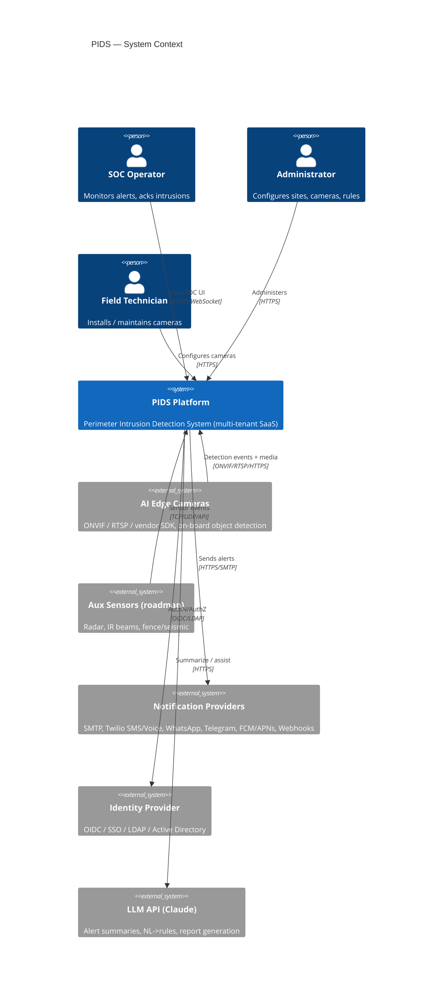
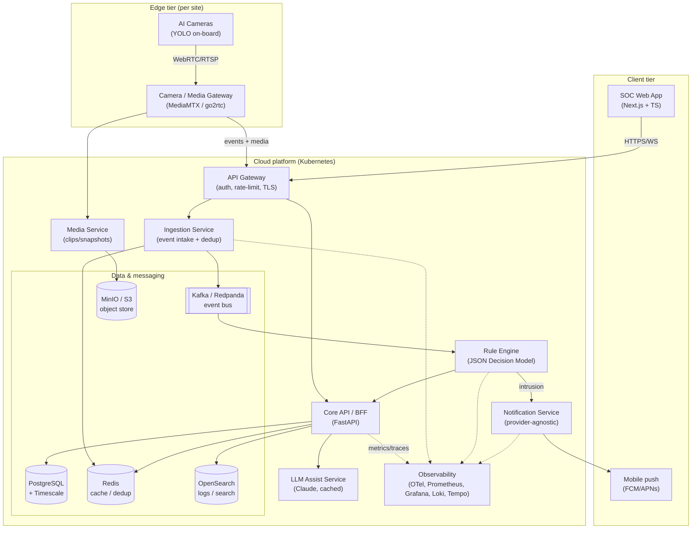
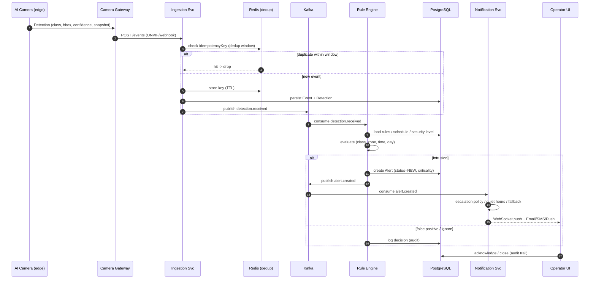
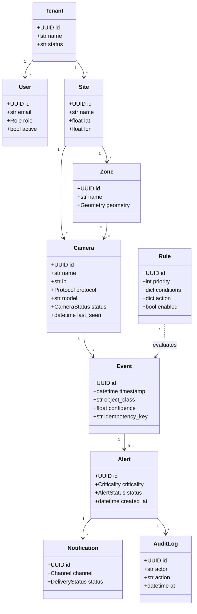
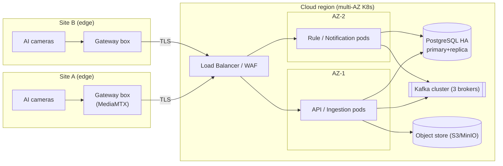
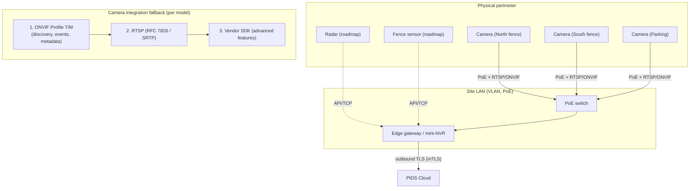

# PIDS — Architecture & Diagrams (2026)

All diagrams are **Mermaid** (render on GitHub and most Markdown viewers). This document
covers the C4 context/container views, the runtime sequence, the class model, the deployment
topology, and the network/edge topology.

---

## 1. C4 — System Context

---

## 2. C4 — Container View

---

## 3. Sequence — Detection to Alert to Notification

---

## 4. Class Diagram — Core Domain

---

## 5. Deployment Topology

---

## 6. Network / Edge Topology & Integration Layering

**Design notes.** Cameras are on an isolated VLAN with PoE; only the edge gateway has outbound
connectivity, over **mTLS**, to the cloud (zero inbound). The gateway normalizes heterogeneous
cameras via the layered pattern (ONVIF → RTSP → vendor SDK) and buffers events during WAN
outages (store-and-forward). This keeps camera credentials off the public internet and bounds
the blast radius of a compromised camera.
