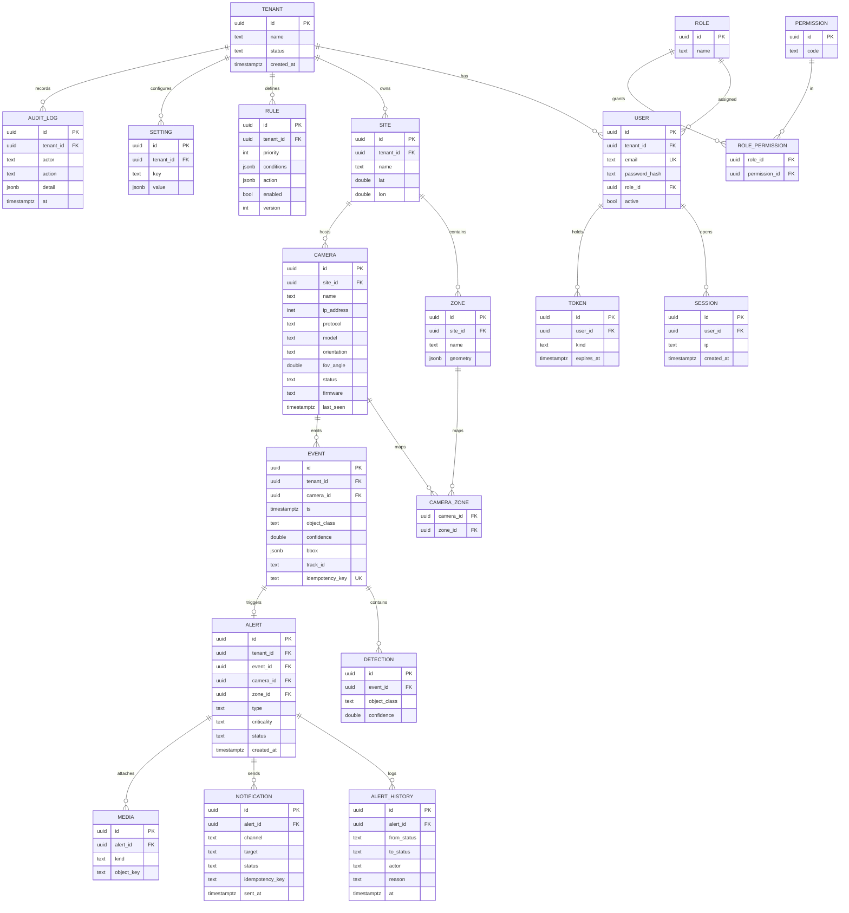

# PIDS — Data Model (ER + Schema)

Target: **PostgreSQL 16** (+ TimescaleDB hypertables for `events`, `notifications`, `audit_logs`).
Multi-tenant isolation via **Row-Level Security (RLS)** keyed on `tenant_id` (recommended MVP
default — lowest operational cost, strong isolation when combined with a per-request
`SET app.tenant_id`). `database-per-tenant` is the upgrade path for regulated/military tenants.

## Entity-Relationship Diagram



## Reference DDL (excerpt)

```sql
-- Tenancy + RLS
CREATE TABLE tenant (
    id          uuid PRIMARY KEY DEFAULT gen_random_uuid(),
    name        text NOT NULL,
    status      text NOT NULL DEFAULT 'active',
    created_at  timestamptz NOT NULL DEFAULT now()
);

CREATE TABLE camera (
    id           uuid PRIMARY KEY DEFAULT gen_random_uuid(),
    tenant_id    uuid NOT NULL REFERENCES tenant(id),
    site_id      uuid NOT NULL REFERENCES site(id),
    name         text NOT NULL,
    ip_address   inet,
    protocol     text NOT NULL CHECK (protocol IN ('ONVIF','RTSP','VENDOR')),
    model        text,
    orientation  text,
    fov_angle    double precision,
    status       text NOT NULL DEFAULT 'unknown'
                 CHECK (status IN ('online','offline','tamper','unknown')),
    firmware     text,
    last_seen    timestamptz
);

-- Event table as a Timescale hypertable, partitioned by time
CREATE TABLE event (
    id               uuid NOT NULL DEFAULT gen_random_uuid(),
    tenant_id        uuid NOT NULL,
    camera_id        uuid NOT NULL,
    ts               timestamptz NOT NULL,
    object_class     text NOT NULL,
    confidence       double precision NOT NULL,
    bbox             jsonb,
    track_id         text,
    idempotency_key  text NOT NULL,
    PRIMARY KEY (id, ts),
    UNIQUE (idempotency_key, ts)
);
-- SELECT create_hypertable('event','ts');

-- Row-Level Security example
ALTER TABLE camera ENABLE ROW LEVEL SECURITY;
CREATE POLICY tenant_isolation ON camera
    USING (tenant_id = current_setting('app.tenant_id')::uuid);
```

## Retention & compliance (ties to §0 of the master prompt)

| Data | Default retention | Notes |
|------|-------------------|-------|
| Video clips / snapshots (`media`) | 30 days (per-tenant configurable) | GDPR minimization; object-store lifecycle policy |
| `event` / `detection` | 90 days hot, then downsampled | Timescale continuous aggregates |
| `alert` / `alert_history` | 1–3 years | Security/forensic value |
| `audit_log` | 1–7 years (immutable, append-only) | Tamper-evident (hash-chained) |
| Biometric match (if enabled) | Keep alert only, **not** raw frame | Special-category data |
