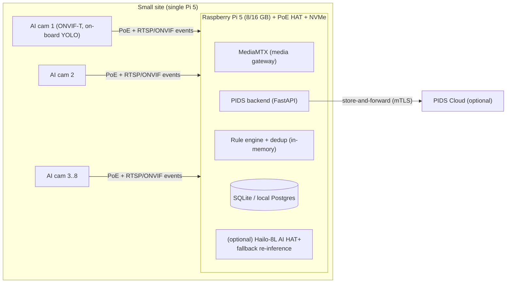
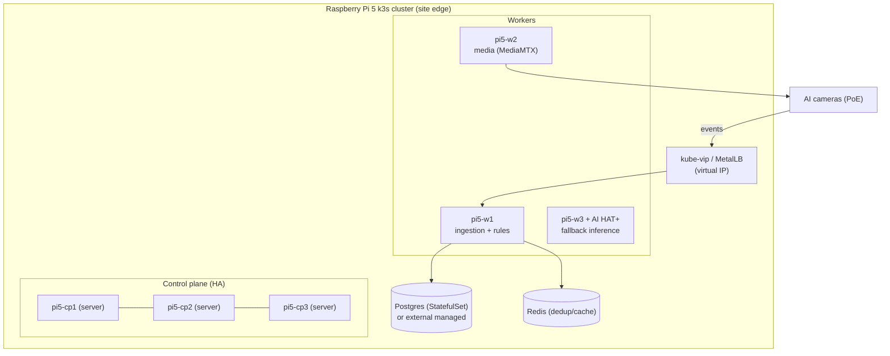
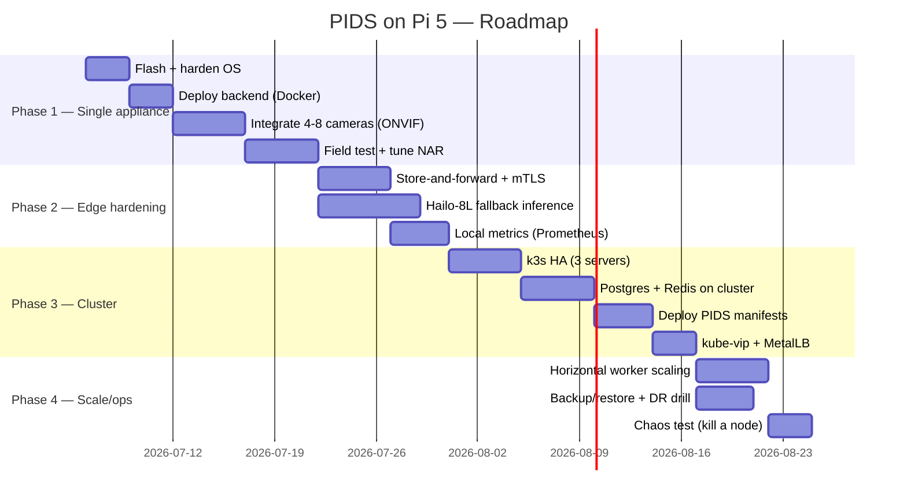

# PIDS on Raspberry Pi 5 — Single Node & Cluster (Chain-of-Thought Guide)

This document studies deploying the PIDS on **Raspberry Pi 5** hardware: first a **single-node
edge appliance** for a small site, then a **Pi 5 cluster** (k3s) for a larger site with HA. It is
written as an explicit **Chain-of-Thought (CoT)** — each design decision shows the reasoning that
leads to it — followed by a **step-by-step guide** and an **implementation roadmap**.

Capacity numbers reference the benchmark in `simulator/benchmark.py` (run it on your own Pi to
calibrate). On the x86 dev host it reports ~278K rule-evals/s, ~771K dedup-ops/s, and ~149
pipeline events/s (SQLite, single process). We derate for the Pi 5 below.

---

## 0. Why Raspberry Pi 5 at all? (CoT)

> **Reasoning →** A PIDS is a *perimeter* system. Perimeters are often at the edge of connectivity
> (industrial yards, remote sites, residential fences). The master prompt's biggest cost lever is
> **edge-first detection** (avoid streaming 24×7 video to the cloud). The Pi 5 is a credible edge
> compute node: quad Cortex-A76 @ 2.4 GHz, up to 16 GB RAM, PCIe 2.0 ×1 (for NVMe *and* an AI
> accelerator via the **AI HAT+ / Hailo-8L**), native dual-camera MIPI, GbE + PoE (with HAT), and
> low power (~5–12 W). It runs Linux, Docker, and k3s.
>
> **Therefore →** Pi 5 fits two roles: (a) a **single-node edge appliance** co-located with a
> handful of cameras, running the full MVP backend locally with store-and-forward to the cloud;
> and (b) as **cluster members** (k3s) when one node isn't enough for cameras/throughput/HA.
>
> **Caveat →** The Pi 5 CPU alone is not enough for many concurrent YOLO streams. Real perimeter
> detection should run **on the AI cameras** (on-board NPU) or on a **Hailo-8L AI HAT+** (13 TOPS)
> attached to the Pi. The Pi then does **business logic** (rules, dedup, alerts, notifications) —
> which is light — and optionally *fallback* re-inference on a few streams.

---

## 1. Use Case A — Single Pi 5 Edge Appliance (small site)

**Scenario:** a residential/commercial site, **4–8 AI cameras** on the fence, intermittent WAN.
One Pi 5 acts as the on-site brain.



### A.1 Sizing (CoT)

> **Reasoning →** After NAR filtering (target < 5 alarms/day/km), the *business-logic* event rate
> is tiny — a busy perimeter peaks around **1 detection / camera / 20 s** (0.05 events/s/camera).
> The pipeline stage is the binding constraint (per-event DB commit). Benchmark: ~149 events/s on
> x86 with SQLite. Derate the Pi 5 CPU **~2–3×** for pure-Python + commit-heavy work → assume
> **~50–75 pipeline events/s** on a Pi 5 with SQLite, more with WAL/Postgres and batched commits.
>
> **Therefore →** capacity ≈ 60 events/s ÷ 0.05 = **~1,200 cameras of business logic** per Pi 5 in
> theory. The **real** limit for a single appliance is not the rule engine — it's **media/streams**
> and NIC/PoE budget. Practically, **cap a single Pi 5 appliance at 4–16 cameras** and let the
> *cameras* do detection. The Pi 5's CPU headroom for rules/alerts is enormous by comparison.

| Resource on one Pi 5 (8 GB) | Comfortable budget |
|---|---|
| AI cameras (detection on-camera) | **4–16** |
| WebRTC/RTSP relay via MediaMTX | 4–8 low-latency viewers |
| Fallback YOLO re-inference (Hailo-8L) | 1–4 streams @ 10–30 FPS |
| Business-logic events/s (rules+dedup+alert) | 50–75 (SQLite) / 150+ (Postgres+WAL) |

### A.2 Hardware BOM — single node

| Item | Qty | Unit $ (2026 est.) |
|------|----:|-------------------:|
| Raspberry Pi 5 (8 GB) | 1 | $80 |
| Official 27 W USB-C PSU (or PoE HAT) | 1 | $12 / $25 |
| PoE+ HAT (if powering over Ethernet) | 1 | $25 |
| Active cooler / case | 1 | $10–20 |
| NVMe HAT + 256 GB NVMe SSD | 1 | $15 + $25 |
| microSD (boot/backup, 32 GB A2) | 1 | $8 |
| **(optional) AI HAT+ (Hailo-8L, 13 TOPS)** | 1 | $70 |
| PoE switch (8-port) for cameras | 1 | $80–150 |
| **Node subtotal (with AI HAT+, excl. switch)** | | **≈ $230–260** |

> **Cost-efficiency note (CoT):** a Pi 5 appliance replaces a $600–2,500 industrial mini-NVR for
> small sites. With detection on the cameras, you rarely need the AI HAT+ — omit it to hit ~$160.

---

## 2. Use Case B — Raspberry Pi 5 Cluster (larger site / HA)

**Scenario:** an industrial site, **dozens of cameras**, needs **high availability** (no single
point of failure) and room to grow. Use a **k3s** cluster of Pi 5 nodes.



### B.1 Why k3s and not full k8s / Docker Swarm? (CoT)

> **Reasoning →** The Pi 5 has limited RAM/CPU; full upstream Kubernetes control-plane overhead is
> wasteful. **k3s** (Rancher) is a certified, single-binary Kubernetes built for ARM/edge: ~512 MB
> footprint, embedded SQLite/etcd, easy HA with 3 server nodes. It gives us self-healing,
> rolling updates, and the *same* manifests we'd run in the cloud (portability = the master
> prompt's cloud-native constraint).
>
> **Therefore →** k3s with **3 server (control-plane) nodes** for quorum HA + **N worker nodes**.
> Embedded **etcd** (`--cluster-init`) gives a fault-tolerant datastore across the 3 servers.
> Use **kube-vip** or **MetalLB** for a floating virtual IP so cameras have one stable endpoint.

### B.2 Data layer on the cluster (CoT)

> **Reasoning →** The MVP defaults to SQLite (single-writer) — fine for one appliance, **wrong**
> for a cluster (no shared writer, no HA). We need a shared, HA datastore.
>
> **Therefore →** run **PostgreSQL** as a StatefulSet on NVMe-backed nodes (e.g. CloudNativePG
> operator for HA + failover), and **Redis** for the shared dedup set (so `RedisDedup` replaces
> `InMemoryDedup` across workers). For the most demanding sites, point at an **external managed
> Postgres** and keep the Pi cluster stateless — cheaper to operate and safer for data.

### B.3 Node roles & count sizing

| Nodes | Role | Notes |
|------:|------|-------|
| 3 | k3s **servers** (control plane, etcd quorum) | Tolerate 1 node failure |
| 1 | worker — **ingestion + rule engine** | Scale horizontally by adding workers |
| 1 | worker — **media gateway** (MediaMTX) | CPU/NIC bound; isolate from logic |
| 1 | worker — **AI HAT+** fallback inference | Optional; Hailo-8L per node |
| — | **Postgres + Redis** | StatefulSet on 2 workers, or external |

> **Capacity (CoT):** each ingestion worker handles ~50–75 pipeline events/s (Postgres/WAL pushes
> this higher). Kafka/Redpanda isn't needed at Pi-cluster scale — the in-cluster ingestion service
> + Redis dedup is enough; adopt the Kafka backbone only when you exceed a single worker's
> throughput or fan out across many sites (that's the cloud tier, not the edge Pi cluster).

### B.4 Cluster BOM (6-node reference)

| Item | Qty | Unit $ | Line $ |
|------|----:|------:|------:|
| Raspberry Pi 5 (8 GB) | 6 | $80 | $480 |
| Active cooler + case | 6 | $15 | $90 |
| NVMe HAT + 256 GB NVMe | 6 | $40 | $240 |
| PoE+ HAT | 6 | $25 | $150 |
| AI HAT+ (Hailo-8L) | 2 | $70 | $140 |
| Managed PoE switch (24-port, 2.5G uplink) | 1 | $250 | $250 |
| Cluster rack / mounting | 1 | $60 | $60 |
| UPS | 1 | $200 | $200 |
| **Cluster subtotal** | | | **≈ $1,610** |

> A 6-node Pi 5 cluster (~$1,600) delivers HA edge compute for a large perimeter for a fraction of
> a rack server — and draws well under 100 W total.

---

## 3. Step-by-Step Guide

### 3.1 Single Pi 5 appliance

```bash
# 1) Flash Raspberry Pi OS (64-bit, Bookworm) with Raspberry Pi Imager.
#    Enable SSH + set hostname (e.g. pids-edge) + Wi-Fi/Ethernet in the imager.

# 2) First boot — update and enable NVMe boot if using the NVMe HAT.
sudo apt update && sudo apt full-upgrade -y
sudo raspi-config    # Advanced -> Boot order -> NVMe/USB; enable PCIe Gen 3 if desired

# 3) Install Docker (recommended) or run natively.
curl -fsSL https://get.docker.com | sh
sudo usermod -aG docker "$USER" && newgrp docker

# 4) Deploy the PIDS backend.
git clone <this-repo> && cd projects/pids-mvp/backend
docker build -t pids-backend .
docker run -d --name pids --restart unless-stopped -p 8000:8000 \
  -e PIDS_SECRET_KEY="$(openssl rand -hex 32)" \
  -e PIDS_ENVIRONMENT=edge \
  -v /opt/pids:/data \
  -e PIDS_DATABASE_URL="sqlite:////data/pids.db" \
  pids-backend

# 5) Seed demo data (first run) and verify.
docker exec pids python -m app.seed
curl -s http://localhost:8000/health

# 6) Media gateway for low-latency viewing (optional).
docker run -d --name mediamtx --restart unless-stopped \
  -p 8554:8554 -p 8889:8889 bluenviron/mediamtx

# 7) Point cameras/gateway at POST http://<pi-ip>:8000/api/v1/events
#    and open frontend/index.html against http://<pi-ip>:8000
```

**Native (no Docker) alternative** — useful on RAM-tight nodes:

```bash
sudo apt install -y python3-venv
python3 -m venv ~/pids && source ~/pids/bin/activate
pip install -r requirements.txt
python -m app.seed
uvicorn app.main:app --host 0.0.0.0 --port 8000
```

### 3.2 (Optional) YOLO on the Pi for fallback re-inference

> **CoT →** Prefer detection **on the cameras**. Use the Pi only for *fallback* re-analysis of a
> few streams (verify a suspicious frame, or for cameras without on-board AI). Two paths:

- **Hailo-8L AI HAT+ (recommended, 13 TOPS):** install HailoRT + `hailo-rpi5-examples`, run a
  compiled YOLO (`.hef`) — real-time multi-stream at low power.
  ```bash
  sudo apt install -y hailo-all
  # verify the accelerator on PCIe:
  hailortcli fw-control identify
  ```
- **CPU-only (no accelerator):** export a small model (YOLO11n/YOLO26n) to **NCNN** or **ONNX**
  and run at reduced FPS — acceptable for occasional verification, not 24×7 multi-stream.
  ```bash
  pip install ultralytics ncnn onnxruntime
  yolo export model=yolo11n.pt format=ncnn
  ```

### 3.3 Raspberry Pi 5 **cluster** with k3s

**Pick two LAN IPs up front** (outside your DHCP range): a **control-plane VIP** (e.g.
`192.168.1.239`) and a **Service LoadBalancer pool** (e.g. `192.168.1.240-250`).

```bash
# 0) Build & push the multi-arch backend image (once) — CI does this automatically, or locally:
REGISTRY=ghcr.io/<owner> ./deploy/k3s/build-and-push.sh

# On pi5-cp1 — bootstrap an HA control plane (embedded etcd).
# --disable servicelb hands LoadBalancer IPs to MetalLB instead of k3s's klipper.
curl -sfL https://get.k3s.io | INSTALL_K3S_EXEC="server --cluster-init \
  --disable traefik --disable servicelb --tls-san 192.168.1.239" sh -
sudo cat /var/lib/rancher/k3s/server/node-token   # copy the token

# On pi5-cp2 and pi5-cp3 — join as additional servers (quorum tolerates 1 failure).
curl -sfL https://get.k3s.io | INSTALL_K3S_EXEC="server \
  --server https://192.168.1.239:6443 --disable traefik --disable servicelb \
  --tls-san 192.168.1.239" K3S_TOKEN=<TOKEN> sh -

# On each worker (pi5-w1..) — join as an agent.
curl -sfL https://get.k3s.io | K3S_URL=https://192.168.1.239:6443 K3S_TOKEN=<TOKEN> sh -

sudo k3s kubectl get nodes -o wide

# 1) Control-plane VIP (kube-vip) — set eth0 / 192.168.1.239 in the file first.
sudo k3s kubectl apply -f deploy/k3s/kube-vip.yaml

# 2) LoadBalancer IPs (MetalLB) — install the operator, then the pool.
sudo k3s kubectl apply -f https://raw.githubusercontent.com/metallb/metallb/v0.14.8/config/manifests/metallb-native.yaml
sudo k3s kubectl -n metallb-system rollout status deploy/controller
sudo k3s kubectl apply -f deploy/k3s/metallb.yaml

# 3) Deploy PIDS (Namespace, Redis, Postgres, API + LoadBalancer + HPA).
sudo k3s kubectl apply -f deploy/k3s/pids.yaml
sudo k3s kubectl -n pids get pods,svc     # pids-api Service should get an EXTERNAL-IP from the pool

# 4) Observability — Prometheus + Grafana, then load the dashboard.
sudo k3s kubectl apply -f deploy/k3s/observability.yaml
sudo k3s kubectl -n monitoring create configmap pids-dashboard \
  --from-file=deploy/monitoring/grafana-dashboard.json
sudo k3s kubectl -n monitoring rollout restart deploy/grafana
# Grafana at http://192.168.1.241:3000 (admin/admin — change it). Cameras POST to the pids-api VIP.
```

> Manifests live in `deploy/k3s/` (`pids.yaml`, `kube-vip.yaml`, `metallb.yaml`,
> `observability.yaml`) and the dashboard in `deploy/monitoring/`. The backend image is built for
> **arm64** by `.github/workflows/build-pids-backend.yml` (or `deploy/k3s/build-and-push.sh`).
> The backend exposes **`/metrics`** (Prometheus) out of the box.

---

## 4. Implementation Roadmap (phased)



| Phase | Goal | Exit criteria |
|------|------|---------------|
| **1. Single appliance** | One Pi 5 running PIDS for a small site | Cameras post events; alerts + notifications fire; SOC console works |
| **2. Edge hardening** | Resilience + optional local inference | Survives WAN outage (store-and-forward); Hailo fallback verifies frames; metrics visible |
| **3. Cluster (k3s HA)** | No single point of failure; shared data | 3-server quorum; Postgres+Redis HA; PIDS pods healthy; VIP stable |
| **4. Scale & ops** | Grow + prove operability | Add worker → throughput scales; DR restore tested; node kill self-heals |

---

## 5. Chain-of-Thought summary of key decisions

| Decision | Reasoning (compressed) |
|----------|------------------------|
| Pi 5 as edge node | Cheap, low-power, Linux/Docker/k3s-capable, PCIe for NVMe + AI HAT+; fits perimeter/edge locations |
| Detection on cameras, not Pi CPU | Pi CPU can't do many concurrent YOLO streams; on-camera NPU (or Hailo-8L) is the right place — Pi does light business logic |
| Single node ≤ 4–16 cameras | Media/NIC/PoE, not rule-engine CPU, is the practical cap; benchmark shows rules/dedup are ~hundreds of K ops/s |
| SQLite for appliance, Postgres+Redis for cluster | SQLite = single writer (fine for one node); a cluster needs a shared HA writer + shared dedup set |
| k3s over full k8s | Lightweight ARM/edge Kubernetes; HA with 3 servers; same manifests as cloud (portability) |
| Kafka only in the cloud tier | At Pi-cluster scale, in-cluster ingestion + Redis dedup suffices; adopt Kafka when a single worker is exceeded |
| Store-and-forward | Perimeters have flaky WAN; buffer events on the Pi and sync when the link returns |

> **Bottom line:** a single **~$230 Pi 5** appliance covers a small site; a **~$1,600 six-node Pi 5
> k3s cluster** gives HA edge compute for a large perimeter — running the *same* PIDS code and
> manifests as the cloud, with detection pushed to the cameras and the Pi handling the (light)
> business logic. Calibrate the exact camera-per-node numbers with `simulator/benchmark.py` on your
> hardware.
